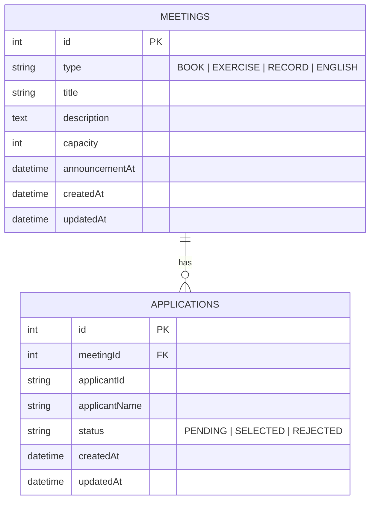

# 상상단 단톡방 모임 신청 시스템

> 📋 **과제 원문**: 모임 생성부터 신청, 선정까지의 과정을 효율적으로 관리할 수 있는 시스템
> 관리자가 신청자를 검토한 뒤 발표일에 선정 결과를 안내하는 방식으로 운영

---

## 📚 목차

- [로컬 실행 방법](#로컬-실행-방법)
- [기술 스택](#기술-스택)
- [주요 기능](#주요-기능)
- [구현 중 주요 고민 사항](#구현-중-주요-고민-사항-및-해결-방법)
- [데이터베이스 설계](#데이터베이스-설계)
- [API 명세](#api-명세)
- [코드 품질 관리](#코드-품질-관리)
- [프로젝트 구조](#프로젝트-구조)
- [과제 소요 시간](#과제-소요-시간)

---

## 로컬 실행 방법

### 1. 사전 요구사항

- **Node.js** 22 이상
- **pnpm** (`npm install -g pnpm`)

### 2. 설치

```bash
# 의존성 설치
pnpm install
```

### 3. 환경 변수 설정 (선택 사항)

```bash
# 백엔드 (기본값 사용 가능)
cp apps/server/.env.example apps/server/.env

# 프론트엔드 (기본값 사용 가능)
cp apps/web/.env.example apps/web/.env
```

**기본 설정값:**
- 백엔드: `http://localhost:4000/api`
- 프론트엔드: `http://localhost:3000`
- 데이터베이스: SQLite (`apps/server/database.sqlite`)

### 4. 개발 서버 실행

```bash
# 🚀 백엔드 + 프론트엔드 동시 실행 (권장)
pnpm dev
```

**개별 실행:**
```bash
# 백엔드만 실행
pnpm start:dev   # → http://localhost:4000/api

# 프론트엔드만 실행
pnpm dev:web     # → http://localhost:3000
```

### 5. 접속 및 테스트

1. **프론트엔드**: http://localhost:3000
   - 모임 목록 확인
   - 모임 신청하기 (상단에서 이름 입력)
   - 내 신청 결과 보기
   - 관리자 페이지 (/admin)

2. **백엔드 API**: http://localhost:4000/api
   - 자동으로 데이터베이스 테이블 생성
   - 모든 API 엔드포인트 활성화

---

## 기술 스택

### 백엔드
- **NestJS** ^11.0.1 - Progressive Node.js Framework
- **TypeORM** ^0.3.28 - ORM
- **SQLite** (better-sqlite3) - 데이터베이스
- **class-validator** - DTO 검증

### 프론트엔드
- **Next.js** 16.1.6 (App Router)
- **React** 19.2.3
- **TypeScript** 5.x
- **TanStack Query** (React Query) - 서버 상태 관리
- **Axios** - HTTP 클라이언트
- **Tailwind CSS** v4 - 스타일링
- **shadcn/ui** - UI 컴포넌트
- **Sonner** - Toast 알림
- **Framer Motion** - 애니메이션
- **next-themes** - 다크모드

### 개발 도구
- **pnpm** - 모노레포 패키지 관리
- **ESLint** - 코드 품질 검사
- **Prettier** - 코드 포맷팅

---

## 주요 기능

### ✅ 사용자 기능

1. **모임 목록 조회**
   - 현재 모집 중인 모임 확인
   - 모임 유형별 배지 (독서, 운동, 기록, 영어)
   - 신청 가능 여부 실시간 표시
   - 신청자 수 / 모집 정원 표시

2. **모임 상세 조회**
   - 모임 제목, 설명, 발표일 확인
   - 본인 신청 상태 확인
   - 신청 가능 여부 판단

3. **모임 신청**
   - 이름 입력 후 모임 신청
   - 중복 신청 방지
   - 발표일 이후 신청 불가
   - 신청 성공 시 Confetti 효과 🎉

4. **내 신청 결과 조회**
   - 신청한 모임 목록 확인
   - **발표일 이전**: PENDING 상태만 표시
   - **발표일 이후**: 선정/탈락 결과 확인

### ✅ 관리자 기능

1. **모임 생성**
   - 모임 유형 선택 (독서, 운동, 기록, 영어)
   - 제목, 설명 입력
   - 모집 정원 설정
   - 발표일 지정

2. **모임 목록 관리**
   - 전체 모임 통계 확인
   - 신청자 수, 선정/탈락/대기 인원 표시

3. **신청자 관리**
   - 모임별 신청자 목록 조회
   - 신청자 정보 확인 (이름, 신청일)

4. **선정/탈락 처리**
   - **발표일 이후에만** 처리 가능
   - PENDING → SELECTED/REJECTED
   - 모집 정원 초과 방지
   - Optimistic UI (즉시 반영)

### ✅ UI/UX 개선 사항

1. **다크모드 지원**
   - 시스템 설정 자동 감지
   - Sun/Moon 토글 버튼
   - 키보드 단축키: `Cmd/Ctrl + Shift + D`

2. **애니메이션**
   - Framer Motion 기반 부드러운 전환
   - 카드 Hover 효과
   - Fade-in / Slide-up 애니메이션

3. **마이크로 인터랙션**
   - 신청 성공 시 Confetti 효과
   - Toast 알림 (Sonner)
   - 로딩 상태 표시

4. **접근성**
   - 키보드 단축키 지원
   - Skip to Content 링크
   - WCAG 2.1 AA 준수
   - 스크린 리더 최적화

5. **에러 핸들링**
   - 자동 재시도 (지수 백오프: 1초, 2초, 4초)
   - 상황별 구체적 에러 메시지 (15가지)
   - 네트워크 오류 감지

---

## 구현 중 주요 고민 사항 및 해결 방법

### 1. 서버 시간 기준 날짜 처리

**문제:** 클라이언트 시간을 신뢰할 수 없음 (시간 조작 가능)

**해결:**
```typescript
// 모든 날짜 비교는 서버 시간 기준
const now = new Date(); // 서버의 현재 시간
const announcementAt = new Date(meeting.announcementAt);
const isAnnouncementPassed = now >= announcementAt;
```

- UTC로 데이터베이스 저장
- 서버에서만 발표일 이전/이후 판단
- 클라이언트는 ISO 8601 문자열로 받아서 표시만

### 2. 발표 전 선정 결과 숨김

**문제:** 발표일 이전에 선정 결과가 노출되면 안 됨

**해결:**
```typescript
// 발표 전에는 PENDING만 표시
let myApplicationStatus = null;
if (myApplication) {
  if (isAnnouncementPassed || myApplication.status === ApplicationStatus.PENDING) {
    myApplicationStatus = myApplication.status;
  }
}
```

- 백엔드에서 발표일 체크
- 발표 전에는 SELECTED/REJECTED 상태를 응답에 포함하지 않음
- 프론트엔드는 서버 응답을 그대로 표시

### 3. 중복 신청 방지

**문제:** 같은 모임에 여러 번 신청 가능성

**해결:**
- **DB 레벨**: `UNIQUE INDEX(meetingId, applicantId)`
- **서비스 레벨**: 명시적 검증
```typescript
const existingApplication = await this.applicationRepository.findOne({
  where: { meetingId, applicantId: dto.applicantId },
});
if (existingApplication) {
  throw new ConflictException("이미 신청한 모임입니다.");
}
```

### 4. 프론트엔드 상태 관리

**문제:** 서버 상태와 클라이언트 상태 동기화

**해결:**
- **React Query** 도입
  - 자동 캐싱 (5분)
  - 자동 재시도 (실패 시)
  - Optimistic UI (즉시 반영)
  - 에러 핸들링 통합

```typescript
export function useApplyToMeeting() {
  return useMutation({
    mutationFn: (data) => meetingsApiClient.applyToMeeting(data),
    onSuccess: () => {
      toast.success("모임 신청이 완료되었습니다!");
      celebrateSuccess(); // 🎉
      queryClient.invalidateQueries({ queryKey: meetingKeys.all });
    },
    onError: (error) => {
      const message = getErrorMessage(error, "신청 중 오류가 발생했습니다.");
      toast.error(message);
    },
  });
}
```

### 5. 선정/탈락 처리 제약 조건

**문제:** 발표일 이전 처리, 정원 초과, 상태 전이 검증 필요

**해결:**
```typescript
// 1. 발표일 체크
if (now < announcementAt) {
  throw new BadRequestException("발표일 이전에는 선정/탈락 처리를 할 수 없습니다.");
}

// 2. 상태 전이 검증 (PENDING만 변경 가능)
if (application.status !== ApplicationStatus.PENDING) {
  throw new BadRequestException("이미 처리된 신청입니다.");
}

// 3. 정원 초과 방지
if (dto.status === ApplicationStatus.SELECTED) {
  const selectedCount = await this.applicationRepository.count({
    where: { meetingId, status: ApplicationStatus.SELECTED },
  });
  if (selectedCount >= meeting.capacity) {
    throw new BadRequestException(`모집 정원이 이미 초과되었습니다.`);
  }
}
```

### 6. 모노레포 구조 선택

**문제:** 백엔드와 프론트엔드를 어떻게 관리할 것인가?

**해결:**
- **pnpm workspace** 사용
- 공통 타입을 `packages/shared`에 배치 (선택)
- 각 앱의 독립성 유지하면서 의존성 공유
- 코드 품질 도구 통합 (ESLint, Prettier)

---

## 데이터베이스 설계

### ERD



### 테이블 상세

#### meetings 테이블
| Column | Type | Constraints | 설명 |
|--------|------|-------------|------|
| id | INTEGER | PRIMARY KEY AUTOINCREMENT | 모임 ID |
| type | VARCHAR | CHECK(type IN (...)) NOT NULL | 모임 유형 |
| title | TEXT | NOT NULL | 모임 제목 |
| description | TEXT | NULLABLE | 모임 설명 |
| capacity | INTEGER | NOT NULL | 모집 정원 |
| announcementAt | DATETIME | NOT NULL | 발표일 |
| createdAt | DATETIME | DEFAULT (datetime('now')) | 생성일 |
| updatedAt | DATETIME | DEFAULT (datetime('now')) | 수정일 |

#### applications 테이블
| Column | Type | Constraints | 설명 |
|--------|------|-------------|------|
| id | INTEGER | PRIMARY KEY AUTOINCREMENT | 신청 ID |
| meetingId | INTEGER | FOREIGN KEY → meetings(id) ON DELETE CASCADE | 모임 ID |
| applicantId | TEXT | NOT NULL | 신청자 ID |
| applicantName | TEXT | NOT NULL | 신청자 이름 |
| status | VARCHAR | CHECK(status IN (...)) DEFAULT 'PENDING' | 신청 상태 |
| createdAt | DATETIME | DEFAULT (datetime('now')) | 신청일 |
| updatedAt | DATETIME | DEFAULT (datetime('now')) | 수정일 |

**제약 조건:**
- `UNIQUE INDEX(meetingId, applicantId)` - 중복 신청 방지
- `FOREIGN KEY(meetingId) ON DELETE CASCADE` - 모임 삭제 시 신청도 삭제

---

## API 명세

### 사용자 API

| Method | Endpoint | 설명 |
|--------|----------|------|
| GET | `/api/meetings?viewerId={id}` | 모임 목록 조회 |
| GET | `/api/meetings/:id?viewerId={id}` | 모임 상세 조회 |
| POST | `/api/meetings/:id/applications` | 모임 신청 |
| GET | `/api/viewer/applications?viewerId={id}` | 내 신청 결과 조회 |

### 관리자 API

| Method | Endpoint | 설명 |
|--------|----------|------|
| POST | `/api/admin/meetings` | 모임 생성 |
| GET | `/api/admin/meetings` | 모임 목록 조회 (통계 포함) |
| GET | `/api/admin/meetings/:id` | 모임 상세 조회 (통계 포함) |
| GET | `/api/admin/meetings/:id/applications` | 신청자 목록 조회 |
| PATCH | `/api/admin/applications/:id/status` | 선정/탈락 처리 |

### 응답 예시

#### 모임 목록 조회
```json
GET /api/meetings?viewerId=user123

[
  {
    "id": 1,
    "type": "BOOK",
    "title": "책 읽기 모임",
    "description": "함께 책을 읽고 토론하는 모임입니다",
    "capacity": 5,
    "announcementAt": "2026-03-20T00:00:00.000Z",
    "applicantCount": 3,
    "canApply": true,
    "myApplicationStatus": "PENDING"
  }
]
```

#### 모임 신청
```json
POST /api/meetings/1/applications
{
  "applicantId": "user123",
  "applicantName": "김철수"
}

→ Response:
{
  "success": true,
  "message": "모임 신청이 완료되었습니다.",
  "applicationId": 1
}
```

---

## 코드 품질 관리

### ESLint + Prettier

전체 프로젝트에 **ESLint**와 **Prettier**를 적용하여 코드 품질을 관리합니다.

```bash
# 코드 자동 포맷팅
pnpm format

# Lint 검사
pnpm lint

# Lint + 자동 수정
pnpm lint:fix
```

**설정 내용:**
- **Prettier**: 들여쓰기 2칸, 큰따옴표, 세미콜론 사용
- **ESLint**: TypeScript 권장 룰 + NestJS/Next.js 최적화
- **통합**: ESLint와 Prettier 충돌 방지

### TypeScript

**strict 모드** 활성화로 타입 안정성 확보:
- 모든 변수에 명시적 타입
- any 사용 최소화 (경고 표시)
- null/undefined 안전 처리

---

## 프로젝트 구조

```
fullstack-assignment-main/
├── apps/
│   ├── server/              # 백엔드 (NestJS)
│   │   ├── src/
│   │   │   ├── entity/      # TypeORM Entity (Meeting, Application)
│   │   │   ├── dto/         # DTO (CreateMeeting, ApplyToMeeting 등)
│   │   │   ├── modules/
│   │   │   │   ├── meetings/  # 사용자 API
│   │   │   │   └── admin/     # 관리자 API
│   │   │   └── config/      # TypeORM, 환경 변수 설정
│   │   └── database.sqlite  # SQLite 데이터베이스 (자동 생성)
│   │
│   └── web/                 # 프론트엔드 (Next.js)
│       ├── app/             # Next.js App Router
│       │   ├── page.tsx           # 모임 목록
│       │   ├── meetings/[id]/     # 모임 상세
│       │   ├── my/                # 내 신청 결과
│       │   └── admin/             # 관리자 페이지
│       ├── components/      # UI 컴포넌트
│       ├── lib/
│       │   ├── api-client/  # API Client (Axios)
│       │   ├── react-query/ # React Query hooks
│       │   └── types.ts     # TypeScript 타입 정의
│       └── ...
│
├── .eslintrc.json          # ESLint 설정
├── .prettierrc             # Prettier 설정
└── README.md
```

---

## 과제 소요 시간

**총 소요 시간: 약 4시간**

### 시간 분배
- **설계 및 기획**: 30분
  - ERD 설계
  - API 명세 작성
  - 기술 스택 선정

- **백엔드 구현**: 1시간 30분
  - Entity 및 DTO 작성
  - Service 비즈니스 로직 구현
  - Controller 및 API 엔드포인트
  - 데이터베이스 설정

- **프론트엔드 구현**: 1시간 30분
  - UI 컴포넌트 작성 (shadcn/ui)
  - API Client 및 React Query 통합
  - 페이지 구현 (목록, 상세, 내 신청, 관리자)

- **UI/UX 개선**: 30분
  - 다크모드 추가
  - 애니메이션 및 Confetti 효과
  - 접근성 향상 (키보드 단축키)

- **코드 품질 및 문서화**: 30분
  - ESLint, Prettier 설정
  - README 작성

---

## 추가 구현 사항 (과제 범위 외)

과제 요구사항을 초과하여 다음과 같은 기능을 추가로 구현했습니다:

### UI/UX 개선
- ✅ **다크모드 지원** (next-themes)
- ✅ **애니메이션 강화** (Framer Motion)
- ✅ **마이크로 인터랙션** (Confetti, Ripple)
- ✅ **Progressive Loading** (Skeleton, Optimistic UI)
- ✅ **에러 복구 강화** (자동 재시도, 구체적 에러 메시지)
- ✅ **접근성 완성** (키보드 단축키, 스크린 리더 최적화)

### 개발 경험 향상
- ✅ **ESLint + Prettier** 통합
- ✅ **TypeScript strict 모드**
- ✅ **모노레포 구조** (pnpm workspace)
- ✅ **API Client 패턴** (Axios + React Query)

---

## 참고 문서

- 📄 [과제 설계사항.md](./과제%20설계사항.md) - 상세 설계 문서
- 📄 [백엔드-구현-완료-보고서.md](./백엔드-구현-완료-보고서.md) - 백엔드 기술 문서
- 📄 [UI-UX-개선-완료-보고서.md](./UI-UX-개선-완료-보고서.md) - 프론트엔드 개선 내역
- 📄 [ESLint-Prettier-설정-완료.md](./ESLint-Prettier-설정-완료.md) - 코드 품질 도구 설정

---

**구현 완료일**: 2026-03-15
**버전**: 1.0.0
**상태**: ✅ 모든 필수 기능 구현 완료
