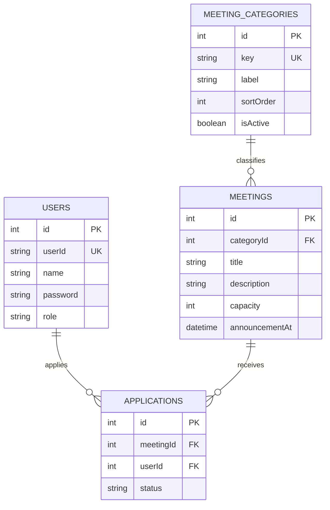

# ASSIGNMENT 기반 설계 문서

## 문서 목적

이 문서는 [ASSIGNMENT.md](/Users/skl-wade/Wade/fullstack-assignment-main/ASSIGNMENT.md)를 읽고,
현재 구현 수준의 프로젝트를 설계할 수 있도록 기준을 정리한 문서다.

목표는 다음 세 가지다.

1. 과제 요구사항을 기능 목록이 아니라 도메인 규칙으로 재해석한다.
2. 과제 범위 안에서 과하지 않은 설계로 사용자/관리자 흐름을 완성한다.
3. 실제 구현 시 백엔드, 프론트엔드, 테스트를 어떤 순서로 만들지 결정한다.

---

## 1. 문제 재정의

### 1-1. 과제가 실제로 요구하는 것

과제의 핵심은 "모임 CRUD"가 아니라 아래 운영 규칙을 가진 신청/선정 시스템이다.

- 사용자는 현재 모집 중인 모임을 둘러볼 수 있어야 한다.
- 사용자는 원하는 모임에 신청할 수 있어야 한다.
- 관리자는 발표일 이후에만 신청자를 선정/탈락 처리할 수 있어야 한다.
- 발표일 이전에는 사용자가 본인 결과를 볼 수 없어야 한다.
- 모집 인원을 초과해 선정되면 안 된다.

즉, 핵심은 "발표일"과 "선정 상태"가 포함된 도메인 규칙이다.

### 1-2. 제품 전제

`상상단`은 내부 운영 도구가 아니라 실제 자기계발 모임 서비스로 본다.
따라서 사용자 경험은 아래처럼 해석한다.

- 모집 중인 모임 목록과 상세는 로그인 없이 둘러볼 수 있다.
- 신청과 내 신청 결과 확인은 로그인 후 가능하다.
- 관리자 기능은 일반 사용자 화면과 분리된 운영 화면으로 둔다.

이 전제가 현재 구현의 UI/라우팅 방향을 결정한다.

---

## 2. 범위와 비범위

### 2-1. 이번 과제에서 구현할 범위

- 모임 종류: 독서, 운동, 기록, 영어
- 모임 생성
- 모임 목록 조회
- 모임 상세 조회
- 모임 신청
- 신청 상태 관리: 대기, 선정, 탈락
- 관리자 선정/탈락 처리
- 발표일 이전 결과 비공개
- 로그인/권한 분리

### 2-2. 이번 과제에서 의도적으로 제외할 범위

- 공개 회원가입
- 신청 취소
- 일괄 선정/탈락
- 페이지네이션
- 실시간 푸시
- 운영 인프라 확장

제외 이유는 단순하다.
과제에서 중요한 것은 기능 수보다 핵심 규칙의 완결성이다.

---

## 3. 핵심 도메인 규칙

### 3-1. 모임 상태 규칙

- `announcementAt` 이전: 모집 중
- `announcementAt` 이후: 모집 종료, 결과 공개 가능

### 3-2. 신청 규칙

- 한 사용자는 한 모임에 한 번만 신청할 수 있다.
- 발표일이 지난 모임에는 신청할 수 없다.

### 3-3. 선정 규칙

- 관리자만 상태를 변경할 수 있다.
- 발표일 이전에는 선정/탈락 처리할 수 없다.
- `PENDING` 상태의 신청만 처리할 수 있다.
- `SELECTED` 인원은 `capacity`를 넘을 수 없다.

### 3-4. 결과 노출 규칙

- 발표일 이전 사용자 응답에서는 `SELECTED`, `REJECTED`를 그대로 노출하지 않는다.
- 발표일 이전에는 사용자의 결과를 `PENDING` 또는 비공개 상태로 보여준다.
- 발표일 이후에만 최종 상태를 노출한다.

---

## 4. 설계 원칙

- 조회는 데이터를 생성하지 않는다.
- 사용자와 관리자는 같은 `user` 엔티티를 쓰고, 역할만 다르게 둔다.
- 불필요한 하위호환 레이어를 남기지 않는다.
- RESTful한 엔드포인트를 사용한다.
- 외부 엔티티 저장소를 직접 끌어다 쓰기보다 모듈 경계를 유지한다.
- 트랜잭션은 정원 초과를 막아야 하는 선정 처리에만 적용한다.
- 프론트는 서버가 계산한 도메인 상태를 소비하고, 규칙을 다시 재판단하지 않는다.

---

## 5. 도메인 모델

### 엔티티별 책임

- `User`
  - 로그인 주체
  - 역할: `USER`, `ADMIN`
- `MeetingCategory`
  - 고정된 모임 종류를 관리
  - enum 대신 테이블로 유지해 정렬/활성 여부를 관리
- `Meeting`
  - 모임 기본 정보와 발표일, 모집 인원을 보유
- `Application`
  - 사용자와 모임 사이의 신청 관계
  - 선정 상태를 보유

### DB 제약

- `users.userId` 유니크
- `applications(meetingId, userId)` 유니크
- 외래키 연결 유지

---

## 6. 사용자 흐름

### 6-1. 비로그인 사용자

1. 홈에서 모집 중인 모임 목록을 본다.
2. 상세 페이지에서 모임 내용을 본다.
3. 신청하려고 하면 로그인으로 유도된다.

### 6-2. 일반 사용자

1. 로그인한다.
2. 모임 목록/상세에서 신청 가능 여부를 확인한다.
3. 원하는 모임에 신청한다.
4. 내 신청 화면에서 발표 전까지는 대기 상태를 본다.
5. 발표일 이후 결과를 확인한다.

### 6-3. 관리자

1. 로그인한다.
2. 운영 대시보드에서 모임을 생성한다.
3. 모임별 신청자 목록을 확인한다.
4. 발표일 이후 선정/탈락 처리한다.

---

## 7. 화면 구조

### 사용자 화면

- `/`
  - 모집 중인 모임 목록
  - 로그인 없이 접근 가능
- `/meetings/:id`
  - 모임 상세
  - 로그인 없이 접근 가능
  - 비로그인 사용자는 신청 CTA에서 로그인 유도
- `/login`
  - seed 계정 기반 로그인
- `/my`
  - 내 신청 결과
  - 로그인 필요

### 관리자 화면

- `/admin`
  - 모임 생성
  - 모임 목록
  - 신청자 목록
  - 선정/탈락 처리
  - 관리자 권한 필요

---

## 8. API 설계

### 인증 API

- `POST /api/auth/login`
- `POST /api/auth/logout`
- `GET /api/auth/me`

### 사용자 API

- `GET /api/meetings`
  - 현재 모집 중인 모임 목록
  - 공개
- `GET /api/meetings/:meetingId`
  - 모임 상세
  - 공개
- `POST /api/meetings/:meetingId/applications`
  - 모임 신청
  - 로그인 필요
- `GET /api/me/applications`
  - 내 신청 결과
  - 로그인 필요

### 관리자 API

- `POST /api/admin/meetings`
- `GET /api/admin/meetings`
- `GET /api/admin/meetings/:meetingId`
- `GET /api/admin/meetings/:meetingId/applications`
- `PATCH /api/admin/meetings/:meetingId/applications/:applicationId`

### 설계 포인트

- 공개 조회와 개인화 조회를 쿼리 파라미터 분기로 섞지 않는다.
- `me`는 세션 사용자 기준 조회에만 사용한다.
- 관리자 상태 변경은 대상 모임과 신청을 URL에서 함께 표현한다.

---

## 9. 백엔드 설계

### 9-1. 모듈 구조

- `auth`
  - 로그인/로그아웃/현재 사용자 조회
  - 세션/권한 가드
- `meetings`
  - 사용자 목록/상세/신청
  - 발표일 기준 응답 가공
- `admin`
  - 모임 생성
  - 신청자 조회
  - 선정/탈락 처리
- `user`
  - 현재 사용자 조회에 필요한 사용자 조회 책임

### 9-2. 서비스 책임 분리

- `MeetingsService`
  - 모집 중 목록 조회
  - 상세 조회
  - 신청
  - 내 신청 결과 조회
- `AdminService`
  - 관리자 모임 생성
  - 신청자 조회
  - 선정/탈락 처리
- `MeetingMapper`
  - 엔티티를 외부 응답 형태로 변환

### 9-3. 검증 책임

- DTO
  - 타입, 길이, 공백, enum 값 검증
- Service
  - 존재 여부, 발표일, 중복, 정원 초과 같은 도메인 규칙 검증

---

## 10. 프론트엔드 설계

### 10-1. 상태 관리 전략

- 서버 상태는 React Query로 관리한다.
- 인증 상태는 `/auth/me`를 기준으로 판단한다.
- 페이지는 서버에서 계산된 `canApply`, `announcementPassed`, `myApplicationStatus`를 그대로 사용한다.

### 10-2. 화면별 역할

- 목록 화면
  - 공개 조회
  - 모집 중인 모임만 노출
- 상세 화면
  - 공개 조회
  - 로그인 여부에 따라 신청 버튼/로그인 유도 분기
- 내 신청 화면
  - 로그인 사용자만 접근
  - 발표 전/후 상태에 따라 다른 결과 표시
- 관리자 화면
  - 운영 기능만 노출

### 10-3. 발표일 경계 처리

- 발표 시점이 지나면 관련 쿼리를 다시 무효화해 화면 상태를 갱신한다.
- 단, 상태의 진실은 프론트가 아니라 서버가 가진다.

---

## 11. 동시성 및 정합성 설계

### 11-1. 신청

- 중복 신청은 DB 유니크 인덱스로 보장한다.
- 서비스는 DB 제약 예외를 `409 Conflict`로 변환한다.
- 같은 사용자가 동시에 여러 번 눌러도 한 건만 성공한다.

### 11-2. 선정

- 정원 초과는 관리자 상태 변경 시점에만 의미가 있다.
- 따라서 선정/탈락 처리에만 트랜잭션을 적용한다.
- 트랜잭션 내부에서 현재 선정 수를 다시 세고, 정원 초과면 거절한다.

### 11-3. 현재 범위와 한계

- 현재 구현은 SQLite 단일 DB 기반 과제 범위를 전제로 한다.
- 진짜 멀티 인스턴스 운영까지 확장하려면 중앙 DB와 재시도 전략이 필요하다.

---

## 12. 예외와 응답 전략

### 사용자 관점

- 모임 없음: 빈 상태 표시
- 신청 성공: 성공 메시지
- 중복 신청: 이미 신청한 모임 안내
- 발표 전 결과: 숨김 또는 대기 상태로 표시

### 관리자 관점

- 발표일 이전 선정 시도: 400
- 정원 초과 선정 시도: 400
- 이미 처리된 신청 재처리: 400

---

## 13. 테스트 전략

### 반드시 자동화할 시나리오

1. 사용자 신청 성공
2. 중복 신청 차단
3. 발표일 이전 결과 비공개
4. 발표일 이후 결과 공개
5. 관리자 발표일 이전 처리 차단
6. 정원 초과 선정 차단
7. 비로그인 목록/상세 공개
8. 비로그인 신청 차단

### 테스트 환경 전략

- 제출용 DB와 테스트 DB를 분리한다.
- E2E는 프로세스별 전용 SQLite를 사용한다.
- 날짜는 상대 시각 기반으로 생성한다.

---

## 14. 구현 순서

### 단계 1. 도메인과 DB

- 엔티티 설계
- 관계와 유니크 인덱스 설계
- seed 계정/카테고리 준비

### 단계 2. 백엔드 사용자 흐름

- 모임 목록
- 모임 상세
- 신청
- 내 신청 결과
- 발표일 전 결과 숨김

### 단계 3. 백엔드 관리자 흐름

- 모임 생성
- 신청자 목록
- 선정/탈락 처리
- 정원 초과 방지

### 단계 4. 인증과 권한

- 로그인/로그아웃
- 현재 사용자 조회
- 관리자 guard

### 단계 5. 프론트엔드

- 공개 목록/상세
- 로그인
- 신청
- 내 신청
- 운영 대시보드

### 단계 6. 검증과 제출 정리

- lint/build/e2e
- README 작성
- seed와 테스트 재현성 점검

---

## 15. 이 설계가 현재 구현으로 이어지는 이유

이 설계는 아래 판단들 때문에 현재 프로젝트 구조로 자연스럽게 이어진다.

- `viewer` 같은 임시 개념보다 로그인 사용자 모델이 더 단순하다.
- 공개 조회와 인증이 필요한 행위를 분리하면 서비스형 UX와 권한 모델이 모두 단순해진다.
- 발표일과 선정 상태를 서버 규칙으로 강제하면 프론트가 가벼워진다.
- 정원 초과는 신청 시점이 아니라 선정 시점의 문제이므로, 트랜잭션은 관리자 상태 변경에만 두는 것이 맞다.
- `MeetingCategory`를 별도 테이블로 유지하면 하드코딩 enum보다 운영 데이터 모델로 읽기 쉽다.

---

## 16. 이후 확장 방향

이 문서를 기반으로 다음 확장을 고려할 수 있다.

- 신청 취소
- 관리자 일괄 처리
- 페이지네이션
- 서버 주도 실시간 갱신
- PostgreSQL 전환
- CI/CD 및 컨테이너화

다만 현재 과제 범위에서는 위 항목보다 핵심 도메인 규칙의 완결성과 검증 신뢰도를 우선한다.
