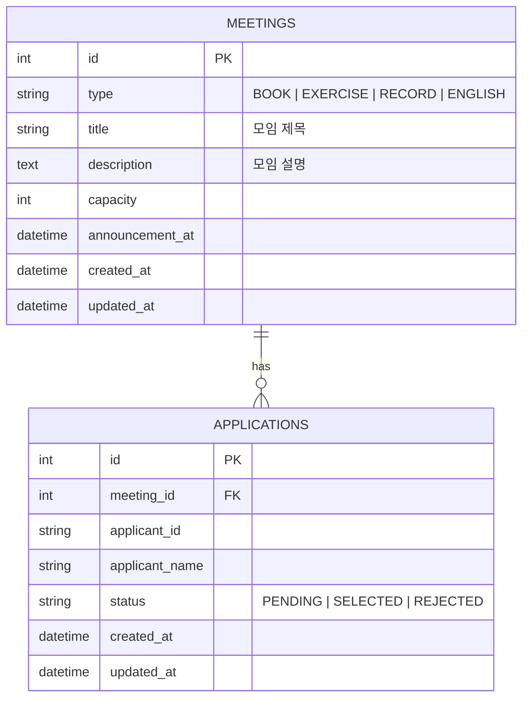

좋습니다. 바로 가져다 쓸 수 있게, **이 저장소 구조에 맞춘 설계안**으로 정리하겠습니다.

이 템플릿은 `pnpm workspace` 모노레포이고, 서버는 NestJS + TypeORM + SQLite, 프론트는 Next App Router 구조입니다. 과제 문서도 `apps/server/src/entity`, `modules`, `apps/web/lib/api-client`, `apps/web/lib/react-query`, `packages/shared` 흐름을 기준으로 안내하고 있고, 서버는 `/api` prefix를 사용합니다. 또 실제 엔티티를 만들면 `_placeholder.entity.ts`와 `entity/index.ts`의 placeholder export를 정리하라고 명시되어 있습니다. 그래서 아래 설계와 코드 뼈대도 그 구조를 그대로 따릅니다. ([GitHub][1])

아래 명세의 전제는 이렇습니다. 과제 문구에 맞춰 **인증은 생략**하고 관리자/사용자 API를 분리합니다. 관리자의 선정/탈락 처리는 **발표일 이후에만 허용**합니다. 사용자는 발표일 이전에 선정 결과를 볼 수 없어야 하므로, 발표 전에는 신청 여부와 `PENDING` 상태까지만 노출되도록 잡았습니다. 모집 인원은 신청 제한이 아니라 **최종 선정 제한**으로 해석했습니다. ([GitHub][1])

---

## 1) ERD



핵심 제약은 이렇게 두면 됩니다.

* `UNIQUE(meeting_id, applicant_id)`
* `capacity > 0`
* `status IN (PENDING, SELECTED, REJECTED)`
* `title NOT NULL`
* `description` (nullable)

설계 메모:

* **Users 테이블은 만들지 않습니다.**
* 사용자 식별은 클라이언트가 생성한 `viewerId`로 처리합니다.
* 관리자 API는 `/admin/*`, 사용자 API는 일반 `/meetings`, `/viewer/*`로 분리합니다.

---

## 1-1) 날짜/시간 처리 전략

### 저장 방식
- 모든 날짜/시간은 **UTC로 데이터베이스에 저장**
- TypeORM의 `datetime` 타입 사용 (SQLite)

### 비교 로직
- 발표일 이전/이후 판단은 **서버 시간 기준**으로 처리
- `new Date()`를 사용하여 서버의 현재 시간과 비교
- 클라이언트 시간은 신뢰하지 않음

### 클라이언트 표시
- API 응답은 ISO 8601 형식 문자열 (`toISOString()`)
- 프론트엔드에서 사용자 로케일에 맞게 변환 (`toLocaleString()`)

### 타임존 정책
- 한국 서비스 가정: 서버를 KST(Asia/Seoul) 환경에서 실행 권장
- 또는 발표일 입력 시 KST 기준 명시

---

## 2) API 명세

### 사용자 API

| Method | Path                                           | 설명         |
| ------ | ---------------------------------------------- | ---------- |
| GET    | `/api/meetings?viewerId={viewerId}`            | 모임 목록 조회   |
| GET    | `/api/meetings/:meetingId?viewerId={viewerId}` | 모임 상세 조회   |
| POST   | `/api/meetings/:meetingId/applications`        | 모임 신청      |
| GET    | `/api/viewer/applications?viewerId={viewerId}` | 내 신청 결과 조회 |

### 관리자 API

| Method | Path                                            | 설명         |
| ------ | ----------------------------------------------- | ---------- |
| POST   | `/api/admin/meetings`                           | 모임 생성      |
| GET    | `/api/admin/meetings`                           | 모임 목록 조회   |
| GET    | `/api/admin/meetings/:meetingId`                | 모임 상세 + 통계 |
| GET    | `/api/admin/meetings/:meetingId/applications`   | 신청자 목록 조회  |
| PATCH  | `/api/admin/applications/:applicationId/status` | 선정/탈락 처리   |

### 공통 에러 정책

| 상황                 | 상태 코드             |
| ------------------ | ----------------- |
| 잘못된 요청 / 잘못된 상태 전이 | `400 Bad Request` |
| 존재하지 않는 모임/신청      | `404 Not Found`   |
| 중복 신청              | `409 Conflict`    |
| 정원 초과 선정           | `409 Conflict`    |

---

### 2-1. 사용자 API 상세

#### `GET /api/meetings?viewerId=v_123`

```json
[
  {
    "id": 1,
    "type": "BOOK",
    "capacity": 10,
    "announcementAt": "2026-03-20T12:00:00.000Z",
    "applicantCount": 14,
    "canApply": true,
    "myApplicationStatus": null
  }
]
```

계산 규칙:

* `canApply = now < announcementAt && myApplicationStatus === null`

---

#### `GET /api/meetings/:meetingId?viewerId=v_123`

```json
{
  "id": 1,
  "type": "BOOK",
  "capacity": 10,
  "announcementAt": "2026-03-20T12:00:00.000Z",
  "applicantCount": 14,
  "canApply": false,
  "myApplication": {
    "id": 7,
    "applicantName": "홍길동",
    "status": "PENDING",
    "appliedAt": "2026-03-14T03:00:00.000Z"
  }
}
```

노출 규칙:

* 발표일 이전: `PENDING`까지만 보임
* 발표일 이후 + 관리자 처리 후: `SELECTED` 또는 `REJECTED`

---

#### `POST /api/meetings/:meetingId/applications`

Request

```json
{
  "applicantId": "v_123",
  "applicantName": "홍길동"
}
```

Success `201`

```json
{
  "id": 7,
  "meetingId": 1,
  "applicantId": "v_123",
  "applicantName": "홍길동",
  "status": "PENDING",
  "appliedAt": "2026-03-14T03:00:00.000Z"
}
```

실패:

* 이미 신청한 경우: `409`
* 발표일이 지난 모임: `400`

---

#### `GET /api/viewer/applications?viewerId=v_123`

```json
[
  {
    "applicationId": 7,
    "meetingId": 1,
    "meetingType": "BOOK",
    "announcementAt": "2026-03-20T12:00:00.000Z",
    "status": "PENDING",
    "appliedAt": "2026-03-14T03:00:00.000Z"
  }
]
```

---

### 2-2. 관리자 API 상세

#### `POST /api/admin/meetings`

Request

```json
{
  "type": "BOOK",
  "capacity": 10,
  "announcementAt": "2026-03-20T12:00:00.000Z"
}
```

Response `201`

```json
{
  "id": 1,
  "type": "BOOK",
  "capacity": 10,
  "announcementAt": "2026-03-20T12:00:00.000Z"
}
```

---

#### `GET /api/admin/meetings/:meetingId`

```json
{
  "id": 1,
  "type": "BOOK",
  "capacity": 10,
  "announcementAt": "2026-03-20T12:00:00.000Z",
  "applicantCount": 14,
  "selectedCount": 3,
  "rejectedCount": 5,
  "pendingCount": 6
}
```

---

#### `GET /api/admin/meetings/:meetingId/applications`

```json
[
  {
    "id": 7,
    "applicantId": "v_123",
    "applicantName": "홍길동",
    "status": "PENDING",
    "appliedAt": "2026-03-14T03:00:00.000Z"
  }
]
```

---

#### `PATCH /api/admin/applications/:applicationId/status`

Request

```json
{
  "status": "SELECTED"
}
```

Response

```json
{
  "id": 7,
  "meetingId": 1,
  "status": "SELECTED",
  "updatedAt": "2026-03-20T12:10:00.000Z"
}
```

검증 규칙:

* 발표일 이전이면 `400`
* `PENDING -> SELECTED/REJECTED`만 허용
* `SELECTED`로 바꿀 때 `selectedCount < capacity`여야 함
* 정원 초과면 `409`

---

## 3) NestJS 코드 뼈대

과제 문서 기준으로 서버는 `modules`에 기능을 추가하고, `app.module.ts` imports에 모듈을 등록하면 됩니다. 엔티티는 `src/entity/index.ts`에서 export해야 TypeORM이 인식되고, placeholder 파일은 실제 엔티티를 만든 뒤 제거하는 흐름입니다. 서버 엔트리는 `/api` prefix를 쓰므로 아래 컨트롤러 경로는 `/api`를 제외한 상대 경로로 작성하면 됩니다. ([GitHub][1])

### 추천 폴더 구조

```txt
apps/server/src/
  entity/
    meeting.entity.ts
    application.entity.ts
    index.ts

  modules/
    app.module.ts

    meetings/
      meetings.module.ts
      meetings.controller.ts
      meetings.service.ts
      dto/
        create-application.dto.ts

    viewer/
      viewer.controller.ts

    admin/
      admin.module.ts
      admin-meetings.controller.ts
      admin-applications.controller.ts
      admin.service.ts
      dto/
        create-meeting.dto.ts
        update-application-status.dto.ts

packages/shared/src/
  types/
    meeting.ts
```

---

### 3-1. shared types

```ts
// packages/shared/src/types/meeting.ts
export enum MeetingType {
  BOOK = "BOOK",
  EXERCISE = "EXERCISE",
  RECORD = "RECORD",
  ENGLISH = "ENGLISH",
}

export enum ApplicationStatus {
  PENDING = "PENDING",
  SELECTED = "SELECTED",
  REJECTED = "REJECTED",
}

export const MEETING_TYPE_LABEL: Record<MeetingType, string> = {
  [MeetingType.BOOK]: "독서",
  [MeetingType.EXERCISE]: "운동",
  [MeetingType.RECORD]: "기록",
  [MeetingType.ENGLISH]: "영어",
};

export interface MeetingListItemResponse {
  id: number;
  type: MeetingType;
  title: string;
  description: string | null;
  capacity: number;
  announcementAt: string;
  applicantCount: number;
  canApply: boolean;
  myApplicationStatus: ApplicationStatus | null;
}

export interface MeetingDetailResponse {
  id: number;
  type: MeetingType;
  title: string;
  description: string | null;
  capacity: number;
  announcementAt: string;
  applicantCount: number;
  canApply: boolean;
  myApplication: {
    id: number;
    applicantName: string;
    status: ApplicationStatus;
    appliedAt: string;
  } | null;
}
```

```ts
// packages/shared/src/types/index.ts
export * from "./meeting";
```

---

### 3-2. Entity

```ts
// apps/server/src/entity/meeting.entity.ts
import {
  Column,
  CreateDateColumn,
  Entity,
  OneToMany,
  PrimaryGeneratedColumn,
  UpdateDateColumn,
} from "typeorm";
import { MeetingType } from "@packages/shared";
import { Application } from "./application.entity";

@Entity("meetings")
export class Meeting {
  @PrimaryGeneratedColumn()
  id: number;

  @Column({ type: "text" })
  type: MeetingType;

  @Column({ type: "text" })
  title: string;

  @Column({ type: "text", nullable: true })
  description: string | null;

  @Column({ type: "integer" })
  capacity: number;

  @Column({ type: "datetime" })
  announcementAt: Date;

  @OneToMany(() => Application, (application) => application.meeting)
  applications: Application[];

  @CreateDateColumn()
  createdAt: Date;

  @UpdateDateColumn()
  updatedAt: Date;
}
```

```ts
// apps/server/src/entity/application.entity.ts
import {
  Column,
  CreateDateColumn,
  Entity,
  JoinColumn,
  ManyToOne,
  PrimaryGeneratedColumn,
  Unique,
  UpdateDateColumn,
} from "typeorm";
import { ApplicationStatus } from "@packages/shared";
import { Meeting } from "./meeting.entity";

@Entity("applications")
@Unique(["meetingId", "applicantId"])
export class Application {
  @PrimaryGeneratedColumn()
  id: number;

  @Column({ type: "integer" })
  meetingId: number;

  @ManyToOne(() => Meeting, (meeting) => meeting.applications, {
    onDelete: "CASCADE",
  })
  @JoinColumn({ name: "meetingId" })
  meeting: Meeting;

  @Column({ type: "text" })
  applicantId: string;

  @Column({ type: "text" })
  applicantName: string;

  @Column({ type: "text", default: ApplicationStatus.PENDING })
  status: ApplicationStatus;

  @CreateDateColumn()
  createdAt: Date;

  @UpdateDateColumn()
  updatedAt: Date;
}
```

```ts
// apps/server/src/entity/index.ts
export * from "./meeting.entity";
export * from "./application.entity";
```

---

### 3-3. DTO

```ts
// apps/server/src/modules/admin/dto/create-meeting.dto.ts
import { IsDateString, IsEnum, IsInt, IsOptional, IsString, Min, MinLength } from "class-validator";
import { MeetingType } from "@packages/shared";

export class CreateMeetingDto {
  @IsEnum(MeetingType)
  type: MeetingType;

  @IsString()
  @MinLength(1)
  title: string;

  @IsOptional()
  @IsString()
  description?: string;

  @IsInt()
  @Min(1)
  capacity: number;

  @IsDateString()
  announcementAt: string;
}
```

```ts
// apps/server/src/modules/meetings/dto/create-application.dto.ts
import { IsString, MinLength } from "class-validator";

export class CreateApplicationDto {
  @IsString()
  @MinLength(1)
  applicantId: string;

  @IsString()
  @MinLength(1)
  applicantName: string;
}
```

```ts
// apps/server/src/modules/admin/dto/update-application-status.dto.ts
import { IsEnum } from "class-validator";
import { ApplicationStatus } from "@packages/shared";

export class UpdateApplicationStatusDto {
  @IsEnum(ApplicationStatus)
  status: ApplicationStatus;
}
```

---

### 3-4. User controller / service

```ts
// apps/server/src/modules/meetings/meetings.controller.ts
import {
  Body,
  Controller,
  Get,
  Param,
  ParseIntPipe,
  Post,
  Query,
} from "@nestjs/common";
import { MeetingsService } from "./meetings.service";
import { CreateApplicationDto } from "./dto/create-application.dto";

@Controller("meetings")
export class MeetingsController {
  constructor(private readonly meetingsService: MeetingsService) {}

  @Get()
  getMeetings(@Query("viewerId") viewerId?: string) {
    return this.meetingsService.getMeetings(viewerId);
  }

  @Get(":meetingId")
  getMeetingDetail(
    @Param("meetingId", ParseIntPipe) meetingId: number,
    @Query("viewerId") viewerId?: string
  ) {
    return this.meetingsService.getMeetingDetail(meetingId, viewerId);
  }

  @Post(":meetingId/applications")
  applyToMeeting(
    @Param("meetingId", ParseIntPipe) meetingId: number,
    @Body() dto: CreateApplicationDto
  ) {
    return this.meetingsService.applyToMeeting(meetingId, dto);
  }
}
```

```ts
// apps/server/src/modules/viewer/viewer.controller.ts
import { Controller, Get, Query } from "@nestjs/common";
import { MeetingsService } from "../meetings/meetings.service";

@Controller("viewer")
export class ViewerController {
  constructor(private readonly meetingsService: MeetingsService) {}

  @Get("applications")
  getViewerApplications(@Query("viewerId") viewerId: string) {
    return this.meetingsService.getViewerApplications(viewerId);
  }
}
```

```ts
// apps/server/src/modules/meetings/meetings.service.ts
import {
  BadRequestException,
  ConflictException,
  Injectable,
  NotFoundException,
} from "@nestjs/common";
import { InjectRepository } from "@nestjs/typeorm";
import { Repository } from "typeorm";
import { Application, Meeting } from "../../entity";
import { ApplicationStatus } from "@packages/shared";
import { CreateApplicationDto } from "./dto/create-application.dto";

@Injectable()
export class MeetingsService {
  constructor(
    @InjectRepository(Meeting)
    private readonly meetingRepository: Repository<Meeting>,
    @InjectRepository(Application)
    private readonly applicationRepository: Repository<Application>
  ) {}

  async getMeetings(viewerId?: string) {
    const meetings = await this.meetingRepository.find({
      relations: { applications: true },
      order: { announcementAt: "ASC" },
    });

    return meetings.map((meeting) => {
      const myApplication = viewerId
        ? meeting.applications.find((a) => a.applicantId === viewerId)
        : null;

      // 중요: 서버 시간 기준으로 발표일 이전/이후 판단
      const now = new Date(); // 서버의 현재 시간
      const announcementAt = new Date(meeting.announcementAt);

      return {
        id: meeting.id,
        type: meeting.type,
        title: meeting.title,
        description: meeting.description,
        capacity: meeting.capacity,
        announcementAt: meeting.announcementAt.toISOString(),
        applicantCount: meeting.applications.length,
        canApply: now < announcementAt && myApplication == null,
        myApplicationStatus: myApplication?.status ?? null,
      };
    });
  }

  async getMeetingDetail(meetingId: number, viewerId?: string) {
    const meeting = await this.meetingRepository.findOne({
      where: { id: meetingId },
      relations: { applications: true },
    });

    if (!meeting) {
      throw new NotFoundException("모임을 찾을 수 없습니다.");
    }

    const myApplication = viewerId
      ? meeting.applications.find((a) => a.applicantId === viewerId)
      : null;

    // 중요: 서버 시간 기준으로 발표일 이전/이후 판단
    const now = new Date(); // 서버의 현재 시간
    const announcementAt = new Date(meeting.announcementAt);

    return {
      id: meeting.id,
      type: meeting.type,
      title: meeting.title,
      description: meeting.description,
      capacity: meeting.capacity,
      announcementAt: meeting.announcementAt.toISOString(),
      applicantCount: meeting.applications.length,
      canApply: now < announcementAt && myApplication == null,
      myApplication: myApplication
        ? {
            id: myApplication.id,
            applicantName: myApplication.applicantName,
            status: myApplication.status,
            appliedAt: myApplication.createdAt.toISOString(),
          }
        : null,
    };
  }

  async applyToMeeting(meetingId: number, dto: CreateApplicationDto) {
    const meeting = await this.meetingRepository.findOne({
      where: { id: meetingId },
    });

    if (!meeting) {
      throw new NotFoundException("모임을 찾을 수 없습니다.");
    }

    // 중요: 서버 시간 기준으로 발표일 검증
    const now = new Date(); // 서버의 현재 시간
    const announcementAt = new Date(meeting.announcementAt);

    if (now >= announcementAt) {
      throw new BadRequestException("발표일 이후에는 신청할 수 없습니다.");
    }

    const existing = await this.applicationRepository.findOne({
      where: {
        meetingId,
        applicantId: dto.applicantId,
      },
    });

    if (existing) {
      throw new ConflictException("이미 신청한 모임입니다.");
    }

    const application = this.applicationRepository.create({
      meetingId,
      applicantId: dto.applicantId,
      applicantName: dto.applicantName,
      status: ApplicationStatus.PENDING,
    });

    const saved = await this.applicationRepository.save(application);

    return {
      id: saved.id,
      meetingId: saved.meetingId,
      applicantId: saved.applicantId,
      applicantName: saved.applicantName,
      status: saved.status,
      appliedAt: saved.createdAt.toISOString(),
    };
  }

  async getViewerApplications(viewerId: string) {
    const applications = await this.applicationRepository.find({
      where: { applicantId: viewerId },
      relations: { meeting: true },
      order: { createdAt: "DESC" },
    });

    return applications.map((application) => ({
      applicationId: application.id,
      meetingId: application.meetingId,
      meetingType: application.meeting.type,
      announcementAt: application.meeting.announcementAt.toISOString(),
      status: application.status,
      appliedAt: application.createdAt.toISOString(),
    }));
  }
}
```

---

### 3-5. Admin controller / service

```ts
// apps/server/src/modules/admin/admin-meetings.controller.ts
import {
  Body,
  Controller,
  Get,
  Param,
  ParseIntPipe,
  Post,
} from "@nestjs/common";
import { AdminService } from "./admin.service";
import { CreateMeetingDto } from "./dto/create-meeting.dto";

@Controller("admin/meetings")
export class AdminMeetingsController {
  constructor(private readonly adminService: AdminService) {}

  @Post()
  createMeeting(@Body() dto: CreateMeetingDto) {
    return this.adminService.createMeeting(dto);
  }

  @Get()
  getMeetings() {
    return this.adminService.getMeetings();
  }

  @Get(":meetingId")
  getMeeting(@Param("meetingId", ParseIntPipe) meetingId: number) {
    return this.adminService.getMeeting(meetingId);
  }

  @Get(":meetingId/applications")
  getMeetingApplications(@Param("meetingId", ParseIntPipe) meetingId: number) {
    return this.adminService.getMeetingApplications(meetingId);
  }
}
```

```ts
// apps/server/src/modules/admin/admin-applications.controller.ts
import {
  Body,
  Controller,
  Param,
  ParseIntPipe,
  Patch,
} from "@nestjs/common";
import { AdminService } from "./admin.service";
import { UpdateApplicationStatusDto } from "./dto/update-application-status.dto";

@Controller("admin/applications")
export class AdminApplicationsController {
  constructor(private readonly adminService: AdminService) {}

  @Patch(":applicationId/status")
  updateStatus(
    @Param("applicationId", ParseIntPipe) applicationId: number,
    @Body() dto: UpdateApplicationStatusDto
  ) {
    return this.adminService.updateApplicationStatus(applicationId, dto);
  }
}
```

```ts
// apps/server/src/modules/admin/admin.service.ts
import {
  BadRequestException,
  ConflictException,
  Injectable,
  NotFoundException,
} from "@nestjs/common";
import { InjectDataSource, InjectRepository } from "@nestjs/typeorm";
import { DataSource, Repository } from "typeorm";
import { Application, Meeting } from "../../entity";
import { CreateMeetingDto } from "./dto/create-meeting.dto";
import { UpdateApplicationStatusDto } from "./dto/update-application-status.dto";
import { ApplicationStatus } from "@packages/shared";

@Injectable()
export class AdminService {
  constructor(
    @InjectRepository(Meeting)
    private readonly meetingRepository: Repository<Meeting>,
    @InjectRepository(Application)
    private readonly applicationRepository: Repository<Application>,
    @InjectDataSource()
    private readonly dataSource: DataSource
  ) {}

  async createMeeting(dto: CreateMeetingDto) {
    const meeting = this.meetingRepository.create({
      type: dto.type,
      title: dto.title,
      description: dto.description || null,
      capacity: dto.capacity,
      announcementAt: new Date(dto.announcementAt),
    });

    const saved = await this.meetingRepository.save(meeting);

    return {
      id: saved.id,
      type: saved.type,
      title: saved.title,
      description: saved.description,
      capacity: saved.capacity,
      announcementAt: saved.announcementAt.toISOString(),
    };
  }

  async getMeetings() {
    const meetings = await this.meetingRepository.find({
      relations: { applications: true },
      order: { createdAt: "DESC" },
    });

    return meetings.map((meeting) => ({
      id: meeting.id,
      type: meeting.type,
      capacity: meeting.capacity,
      announcementAt: meeting.announcementAt.toISOString(),
      applicantCount: meeting.applications.length,
      selectedCount: meeting.applications.filter(
        (a) => a.status === ApplicationStatus.SELECTED
      ).length,
    }));
  }

  async getMeeting(meetingId: number) {
    const meeting = await this.meetingRepository.findOne({
      where: { id: meetingId },
      relations: { applications: true },
    });

    if (!meeting) {
      throw new NotFoundException("모임을 찾을 수 없습니다.");
    }

    const selectedCount = meeting.applications.filter(
      (a) => a.status === ApplicationStatus.SELECTED
    ).length;
    const rejectedCount = meeting.applications.filter(
      (a) => a.status === ApplicationStatus.REJECTED
    ).length;
    const pendingCount = meeting.applications.filter(
      (a) => a.status === ApplicationStatus.PENDING
    ).length;

    return {
      id: meeting.id,
      type: meeting.type,
      capacity: meeting.capacity,
      announcementAt: meeting.announcementAt.toISOString(),
      applicantCount: meeting.applications.length,
      selectedCount,
      rejectedCount,
      pendingCount,
    };
  }

  async getMeetingApplications(meetingId: number) {
    const meeting = await this.meetingRepository.findOne({
      where: { id: meetingId },
    });

    if (!meeting) {
      throw new NotFoundException("모임을 찾을 수 없습니다.");
    }

    const applications = await this.applicationRepository.find({
      where: { meetingId },
      order: { createdAt: "ASC" },
    });

    return applications.map((application) => ({
      id: application.id,
      applicantId: application.applicantId,
      applicantName: application.applicantName,
      status: application.status,
      appliedAt: application.createdAt.toISOString(),
    }));
  }

  async updateApplicationStatus(
    applicationId: number,
    dto: UpdateApplicationStatusDto
  ) {
    if (dto.status === ApplicationStatus.PENDING) {
      throw new BadRequestException("관리자는 선정 또는 탈락만 처리할 수 있습니다.");
    }

    // 중요: 트랜잭션으로 정원 초과 방지 보장
    return this.dataSource.transaction(async (manager) => {
      const applicationRepository = manager.getRepository(Application);

      const application = await applicationRepository.findOne({
        where: { id: applicationId },
        relations: { meeting: true },
      });

      if (!application) {
        throw new NotFoundException("신청 정보를 찾을 수 없습니다.");
      }

      // 중요: 서버 시간 기준으로 발표일 검증
      const now = new Date(); // 서버의 현재 시간
      const announcementAt = new Date(application.meeting.announcementAt);

      if (now < announcementAt) {
        throw new BadRequestException("발표일 이후에만 선정/탈락 처리할 수 있습니다.");
      }

      const selectedCount = await applicationRepository.count({
        where: {
          meetingId: application.meetingId,
          status: ApplicationStatus.SELECTED,
        },
      });

      const willIncreaseSelectedCount =
        application.status !== ApplicationStatus.SELECTED &&
        dto.status === ApplicationStatus.SELECTED;

      if (
        willIncreaseSelectedCount &&
        selectedCount >= application.meeting.capacity
      ) {
        throw new ConflictException("모집 인원을 초과하여 선정할 수 없습니다.");
      }

      application.status = dto.status;
      const saved = await applicationRepository.save(application);

      return {
        id: saved.id,
        meetingId: saved.meetingId,
        status: saved.status,
        updatedAt: saved.updatedAt.toISOString(),
      };
    });
  }
}
```

---

### 3-6. Module 등록

```ts
// apps/server/src/modules/meetings/meetings.module.ts
import { Module } from "@nestjs/common";
import { TypeOrmModule } from "@nestjs/typeorm";
import { Application, Meeting } from "../../entity";
import { MeetingsController } from "./meetings.controller";
import { MeetingsService } from "./meetings.service";
import { ViewerController } from "../viewer/viewer.controller";

@Module({
  imports: [TypeOrmModule.forFeature([Meeting, Application])],
  controllers: [MeetingsController, ViewerController],
  providers: [MeetingsService],
  exports: [MeetingsService],
})
export class MeetingsModule {}
```

```ts
// apps/server/src/modules/admin/admin.module.ts
import { Module } from "@nestjs/common";
import { TypeOrmModule } from "@nestjs/typeorm";
import { Application, Meeting } from "../../entity";
import { AdminMeetingsController } from "./admin-meetings.controller";
import { AdminApplicationsController } from "./admin-applications.controller";
import { AdminService } from "./admin.service";

@Module({
  imports: [TypeOrmModule.forFeature([Meeting, Application])],
  controllers: [AdminMeetingsController, AdminApplicationsController],
  providers: [AdminService],
})
export class AdminModule {}
```

```ts
// apps/server/src/modules/app.module.ts
import { Module } from "@nestjs/common";
import { ConfigModule } from "@nestjs/config";
import { TypeOrmModule } from "@nestjs/typeorm";
import { createTypeOrmOptions, getEnvFilePath } from "../config";
import { MeetingsModule } from "./meetings/meetings.module";
import { AdminModule } from "./admin/admin.module";

@Module({
  imports: [
    ConfigModule.forRoot({
      envFilePath: getEnvFilePath(),
      isGlobal: true,
    }),
    TypeOrmModule.forRootAsync({
      useFactory: createTypeOrmOptions,
    }),
    MeetingsModule,
    AdminModule,
  ],
})
export class AppModule {}
```

---

## 4) Next.js 코드 뼈대

프론트 쪽에는 axios base client와 React Query provider 파일이 이미 준비돼 있고, 웹 `.env.example`도 `NEXT_PUBLIC_API_URL=http://localhost:4000/api`를 기준으로 잡혀 있습니다. 그래서 프론트는 **viewer 식별 유틸 + api client + query hooks + client component**만 얹으면 됩니다. ([GitHub][2])

### 추천 폴더 구조

```txt
apps/web/
  app/
    page.tsx
    meetings/[meetingId]/page.tsx
    my/page.tsx
    admin/page.tsx

  components/
    meeting-list-client.tsx
    meeting-detail-client.tsx
    my-applications-client.tsx
    admin-dashboard-client.tsx

  lib/
    viewer.ts
    api-client/
      base.ts
      meetings.ts
      admin.ts
    react-query/
      provider.tsx
      meetings.ts
      admin.ts
```

---

### 4-1. viewer 식별 유틸

```ts
// apps/web/lib/viewer.ts
export interface ViewerIdentity {
  viewerId: string;
  viewerName: string;
}

const STORAGE_KEY = "ssq-viewer";

export function getViewerIdentity(): ViewerIdentity | null {
  if (typeof window === "undefined") return null;

  const raw = window.localStorage.getItem(STORAGE_KEY);
  if (!raw) return null;

  try {
    return JSON.parse(raw) as ViewerIdentity;
  } catch {
    return null;
  }
}

export function ensureViewerIdentity(): ViewerIdentity {
  const existing = getViewerIdentity();
  if (existing) return existing;

  const created: ViewerIdentity = {
    viewerId: crypto.randomUUID(),
    viewerName: "익명 사용자",
  };

  window.localStorage.setItem(STORAGE_KEY, JSON.stringify(created));
  return created;
}

export function updateViewerName(viewerName: string) {
  const current = ensureViewerIdentity();
  const next = { ...current, viewerName };
  window.localStorage.setItem(STORAGE_KEY, JSON.stringify(next));
  return next;
}
```

---

### 4-2. API client

```ts
// apps/web/lib/api-client/meetings.ts
import { BaseApiClient } from "./base";

class MeetingsApiClient extends BaseApiClient {
  async getMeetings(viewerId?: string) {
    const response = await this.api.get("/meetings", {
      params: viewerId ? { viewerId } : undefined,
    });
    return response.data;
  }

  async getMeetingDetail(meetingId: number, viewerId?: string) {
    const response = await this.api.get(`/meetings/${meetingId}`, {
      params: viewerId ? { viewerId } : undefined,
    });
    return response.data;
  }

  async applyToMeeting(
    meetingId: number,
    body: {
      applicantId: string;
      applicantName: string;
    }
  ) {
    const response = await this.api.post(
      `/meetings/${meetingId}/applications`,
      body
    );
    return response.data;
  }

  async getViewerApplications(viewerId: string) {
    const response = await this.api.get("/viewer/applications", {
      params: { viewerId },
    });
    return response.data;
  }
}

export const meetingsApiClient = new MeetingsApiClient();
```

```ts
// apps/web/lib/api-client/admin.ts
import { BaseApiClient } from "./base";

class AdminApiClient extends BaseApiClient {
  async createMeeting(body: {
    type: "BOOK" | "EXERCISE" | "RECORD" | "ENGLISH";
    capacity: number;
    announcementAt: string;
  }) {
    const response = await this.api.post("/admin/meetings", body);
    return response.data;
  }

  async getMeetings() {
    const response = await this.api.get("/admin/meetings");
    return response.data;
  }

  async getMeetingApplications(meetingId: number) {
    const response = await this.api.get(
      `/admin/meetings/${meetingId}/applications`
    );
    return response.data;
  }

  async updateApplicationStatus(
    applicationId: number,
    status: "SELECTED" | "REJECTED"
  ) {
    const response = await this.api.patch(
      `/admin/applications/${applicationId}/status`,
      { status }
    );
    return response.data;
  }
}

export const adminApiClient = new AdminApiClient();
```

---

### 4-3. React Query hooks

```ts
// apps/web/lib/react-query/meetings.ts
"use client";

import { useMutation, useQuery, useQueryClient } from "@tanstack/react-query";
import { meetingsApiClient } from "../api-client/meetings";

export const meetingKeys = {
  all: ["meetings"] as const,
  detail: (meetingId: number, viewerId?: string) =>
    ["meetings", meetingId, viewerId] as const,
  viewerApplications: (viewerId?: string) =>
    ["viewer-applications", viewerId] as const,
};

export function useMeetings(viewerId?: string) {
  return useQuery({
    queryKey: [...meetingKeys.all, viewerId],
    queryFn: () => meetingsApiClient.getMeetings(viewerId),
  });
}

export function useMeetingDetail(meetingId: number, viewerId?: string) {
  return useQuery({
    queryKey: meetingKeys.detail(meetingId, viewerId),
    queryFn: () => meetingsApiClient.getMeetingDetail(meetingId, viewerId),
    enabled: Number.isFinite(meetingId),
  });
}

export function useViewerApplications(viewerId?: string) {
  return useQuery({
    queryKey: meetingKeys.viewerApplications(viewerId),
    queryFn: () => meetingsApiClient.getViewerApplications(viewerId!),
    enabled: Boolean(viewerId),
  });
}

export function useApplyToMeeting() {
  const queryClient = useQueryClient();

  return useMutation({
    mutationFn: ({
      meetingId,
      applicantId,
      applicantName,
    }: {
      meetingId: number;
      applicantId: string;
      applicantName: string;
    }) =>
      meetingsApiClient.applyToMeeting(meetingId, {
        applicantId,
        applicantName,
      }),
    onSuccess: () => {
      void queryClient.invalidateQueries({ queryKey: ["meetings"] });
      void queryClient.invalidateQueries({ queryKey: ["viewer-applications"] });
    },
  });
}
```

```ts
// apps/web/lib/react-query/admin.ts
"use client";

import { useMutation, useQuery, useQueryClient } from "@tanstack/react-query";
import { adminApiClient } from "../api-client/admin";

export function useAdminMeetings() {
  return useQuery({
    queryKey: ["admin-meetings"],
    queryFn: () => adminApiClient.getMeetings(),
  });
}

export function useAdminMeetingApplications(meetingId?: number) {
  return useQuery({
    queryKey: ["admin-meeting-applications", meetingId],
    queryFn: () => adminApiClient.getMeetingApplications(meetingId!),
    enabled: Boolean(meetingId),
  });
}

export function useCreateMeeting() {
  const queryClient = useQueryClient();

  return useMutation({
    mutationFn: adminApiClient.createMeeting.bind(adminApiClient),
    onSuccess: () => {
      void queryClient.invalidateQueries({ queryKey: ["admin-meetings"] });
      void queryClient.invalidateQueries({ queryKey: ["meetings"] });
    },
  });
}

export function useUpdateApplicationStatus() {
  const queryClient = useQueryClient();

  return useMutation({
    mutationFn: ({
      applicationId,
      status,
    }: {
      applicationId: number;
      status: "SELECTED" | "REJECTED";
    }) => adminApiClient.updateApplicationStatus(applicationId, status),
    onSuccess: () => {
      void queryClient.invalidateQueries({
        queryKey: ["admin-meeting-applications"],
      });
      void queryClient.invalidateQueries({ queryKey: ["admin-meetings"] });
      void queryClient.invalidateQueries({ queryKey: ["meetings"] });
      void queryClient.invalidateQueries({ queryKey: ["viewer-applications"] });
    },
  });
}
```

---

### 4-4. 페이지 뼈대

```tsx
// apps/web/app/page.tsx
import { MeetingListClient } from "@/components/meeting-list-client";

export default function HomePage() {
  return <MeetingListClient />;
}
```

```tsx
// apps/web/components/meeting-list-client.tsx
"use client";

import Link from "next/link";
import { useEffect, useState } from "react";
import { ensureViewerIdentity, updateViewerName } from "@/lib/viewer";
import { useMeetings } from "@/lib/react-query/meetings";
import { MEETING_TYPE_LABEL } from "@packages/shared";

export function MeetingListClient() {
  const [viewerId, setViewerId] = useState<string>();
  const [viewerName, setViewerName] = useState("");

  useEffect(() => {
    const viewer = ensureViewerIdentity();
    setViewerId(viewer.viewerId);
    setViewerName(viewer.viewerName);
  }, []);

  const { data, isLoading } = useMeetings(viewerId);

  return (
    <main className="mx-auto max-w-4xl space-y-6 p-6">
      <header className="space-y-2">
        <h1 className="text-2xl font-semibold">상상단 단톡방 모임</h1>

        <div className="flex gap-2">
          <input
            className="rounded border px-3 py-2"
            value={viewerName}
            onChange={(e) => setViewerName(e.target.value)}
            placeholder="이름을 입력하세요"
          />
          <button
            className="rounded border px-3 py-2"
            onClick={() => updateViewerName(viewerName)}
          >
            저장
          </button>
          <Link className="rounded border px-3 py-2" href="/my">
            내 신청 결과
          </Link>
          <Link className="rounded border px-3 py-2" href="/admin">
            관리자
          </Link>
        </div>
      </header>

      {isLoading && <p>불러오는 중...</p>}

      <div className="grid gap-4">
        {data?.map((meeting: any) => (
          <Link
            key={meeting.id}
            href={`/meetings/${meeting.id}`}
            className="rounded border p-4"
          >
            <div className="text-lg font-medium">
              {MEETING_TYPE_LABEL[meeting.type]}
            </div>
            <div className="text-sm text-gray-600">
              모집 인원 {meeting.capacity}명 · 신청 {meeting.applicantCount}명
            </div>
            <div className="text-sm text-gray-600">
              발표일 {new Date(meeting.announcementAt).toLocaleString()}
            </div>
            <div className="mt-2 text-sm">
              {meeting.canApply ? "신청 가능" : "신청 불가"}
            </div>
          </Link>
        ))}
      </div>
    </main>
  );
}
```

나머지 페이지는 이렇게 나누면 됩니다.

* `/meetings/[meetingId]`
  상세 정보 + 신청 버튼 + 내 신청 상태
* `/my`
  내 신청 목록 + 상태 배지
* `/admin`
  모임 생성 폼 + 모임 목록 + 선택한 모임의 신청자 목록 + 선정/탈락 버튼

---

### 4-5. 프론트엔드 에러 처리

프론트엔드에서 사용자 친화적인 에러 처리를 위한 유틸리티와 패턴입니다.

#### Toast 알림 시스템

```ts
// apps/web/lib/toast.ts
"use client";

type ToastType = "success" | "error" | "info";

interface Toast {
  id: string;
  type: ToastType;
  message: string;
}

let toasts: Toast[] = [];
let listeners: Array<(toasts: Toast[]) => void> = [];

export const toast = {
  success: (message: string) => addToast("success", message),
  error: (message: string) => addToast("error", message),
  info: (message: string) => addToast("info", message),
};

function addToast(type: ToastType, message: string) {
  const id = crypto.randomUUID();
  const newToast: Toast = { id, type, message };

  toasts = [...toasts, newToast];
  notifyListeners();

  // 3초 후 자동 제거
  setTimeout(() => {
    toasts = toasts.filter((t) => t.id !== id);
    notifyListeners();
  }, 3000);
}

function notifyListeners() {
  listeners.forEach((listener) => listener(toasts));
}

export function useToasts() {
  const [currentToasts, setCurrentToasts] = useState<Toast[]>(toasts);

  useEffect(() => {
    listeners.push(setCurrentToasts);
    return () => {
      listeners = listeners.filter((l) => l !== setCurrentToasts);
    };
  }, []);

  return currentToasts;
}
```

#### API 에러 처리 Hook

```ts
// apps/web/lib/hooks/use-api-error.ts
"use client";

import { AxiosError } from "axios";
import { toast } from "../toast";

export function useApiError() {
  const handleError = (error: unknown) => {
    if (error instanceof AxiosError) {
      const message = error.response?.data?.message || "요청 처리 중 오류가 발생했습니다.";
      const status = error.response?.status;

      switch (status) {
        case 400:
          toast.error(`잘못된 요청: ${message}`);
          break;
        case 404:
          toast.error("요청한 리소스를 찾을 수 없습니다.");
          break;
        case 409:
          toast.error(message); // 중복 신청, 정원 초과 등
          break;
        default:
          toast.error(message);
      }
    } else {
      toast.error("알 수 없는 오류가 발생했습니다.");
    }
  };

  return { handleError };
}
```

#### React Query 에러 처리 통합

```ts
// apps/web/lib/react-query/meetings.ts에 추가
export function useApplyToMeeting() {
  const queryClient = useQueryClient();
  const { handleError } = useApiError();

  return useMutation({
    mutationFn: ({
      meetingId,
      applicantId,
      applicantName,
    }: {
      meetingId: number;
      applicantId: string;
      applicantName: string;
    }) =>
      meetingsApiClient.applyToMeeting(meetingId, {
        applicantId,
        applicantName,
      }),
    onSuccess: () => {
      toast.success("모임 신청이 완료되었습니다!");
      void queryClient.invalidateQueries({ queryKey: ["meetings"] });
      void queryClient.invalidateQueries({ queryKey: ["viewer-applications"] });
    },
    onError: handleError,
  });
}
```

#### Toast 컴포넌트

```tsx
// apps/web/components/toast-container.tsx
"use client";

import { useToasts } from "@/lib/toast";

export function ToastContainer() {
  const toasts = useToasts();

  return (
    <div className="fixed bottom-4 right-4 z-50 flex flex-col gap-2">
      {toasts.map((toast) => (
        <div
          key={toast.id}
          className={`rounded-lg px-4 py-3 shadow-lg ${
            toast.type === "success"
              ? "bg-green-500 text-white"
              : toast.type === "error"
              ? "bg-red-500 text-white"
              : "bg-blue-500 text-white"
          }`}
        >
          {toast.message}
        </div>
      ))}
    </div>
  );
}
```

#### layout.tsx에 Toast 추가

```tsx
// apps/web/app/layout.tsx
import { ToastContainer } from "@/components/toast-container";

export default function RootLayout({ children }) {
  return (
    <html>
      <body>
        <ReactQueryProvider>
          {children}
          <ToastContainer />
        </ReactQueryProvider>
      </body>
    </html>
  );
}
```

---

## 5) README 최종본 문구

과제 문서는 README에 **로컬 실행 방법, 구현 고민/해결, DB 설계, 미구현/개선, 실제 소요 시간**을 반드시 포함하라고 요구합니다. 또 실행 환경은 Node.js 22+, pnpm, `.env.example`, `pnpm dev` / `pnpm start:dev` / `pnpm dev:web` 흐름으로 안내돼 있습니다. 아래 README는 그 요구사항을 그대로 맞춘 버전입니다. ([GitHub][1])

````md
# 상상단 단톡방 모임 신청 시스템

상상단의 단톡방 모임 신청 및 선정 과정을 관리하기 위한 간단한 풀스택 서비스입니다.

이번 과제는 단순 CRUD보다 **모임 신청과 선정 프로세스를 운영 규칙 중심으로 모델링하는 것**에 초점을 맞췄습니다.  
특히 아래 4가지를 핵심 규칙으로 두고 구현했습니다.

- 발표일 이전에는 선정 결과가 사용자에게 노출되지 않음
- 동일 사용자의 중복 신청 방지
- 발표일 이후에만 관리자 선정/탈락 처리 가능
- 모집 인원(capacity)을 초과한 선정 방지

---

## 기술 스택

### Backend
- NestJS
- TypeORM
- SQLite

### Frontend
- Next.js (App Router)
- React Query
- Axios
- Tailwind CSS

### Shared
- TypeScript
- pnpm workspace

---

## 로컬 실행 방법

### 1. 요구사항
- Node.js 22 이상
- pnpm

### 2. 설치

```bash
pnpm install
````

### 3. 환경 변수 설정

백엔드

```bash
# apps/server/.env
PORT=4000
```

프론트엔드

```bash
# apps/web/.env
NEXT_PUBLIC_API_URL=http://localhost:4000/api
```

### 4. 실행

전체 동시 실행

```bash
pnpm dev
```

또는 개별 실행

```bash
# backend
pnpm start:dev

# frontend
pnpm dev:web
```

### 5. 접속

* Backend: `http://localhost:4000/api`
* Frontend: `http://localhost:3000`

---

## 과제 해석 및 구현 범위

이 과제를 단순한 모임 CRUD가 아니라,
**모임 생성 → 신청 → 발표일 이후 선정/탈락 처리 → 사용자 결과 확인**
흐름을 다루는 작은 운영 시스템으로 해석했습니다.

인증은 선택 사항이므로 이번 구현에서는 실제 로그인 대신 아래 방식으로 단순화했습니다.

* 관리자 기능은 `/admin/*` API로 분리
* 사용자 식별은 클라이언트에서 생성한 `viewerId` 사용

이렇게 해서 인증 구현보다 **도메인 규칙과 상태 일관성**에 집중했습니다.

---

## 주요 기능

### 사용자

* 모임 목록 조회
* 모임 상세 조회
* 모임 신청
* 내 신청 결과 조회

### 관리자

* 모임 생성
* 모임별 신청자 목록 조회
* 발표일 이후 선정/탈락 처리

---

## 주요 설계 결정

### 1. 인증보다 역할 분리 API를 우선했다

과제에서 관리자/사용자 구분은 인증 없이도 가능하다고 안내되어 있어,
제한된 시간 안에 핵심 도메인 규칙 구현에 집중하기 위해 관리자/사용자 API를 분리했습니다.

### 2. 모집 인원은 신청 제한이 아니라 최종 선정 제한으로 해석했다

이 서비스는 선착순이 아니라 발표일 이후 관리자가 신청자를 검토해 선정하는 구조이므로,
모집 인원은 신청 수가 아니라 **최종 선정 수를 제한하는 값**으로 보았습니다.

### 3. 발표일 이전에는 결과가 노출되지 않도록 했다

사용자는 발표일 이전에 선정/탈락 결과를 볼 수 없어야 하므로,
발표 전에는 신청 여부와 `PENDING` 상태까지만 확인할 수 있게 했습니다.

### 4. 정원 초과 선정은 서버에서 명시적으로 차단했다

선정은 단순한 상태 변경이 아니라 모집 인원 제약을 동반하는 운영 액션으로 보고,
정원을 초과하는 선정 시도는 서버에서 실패 처리하도록 구현했습니다.

---

## 신청 상태

| 상태       | 설명                       |
| -------- | ------------------------ |
| PENDING  | 신청 완료 후 관리자 검토 전 상태      |
| SELECTED | 발표일 이후 관리자에 의해 선정된 상태    |
| REJECTED | 발표일 이후 관리자에 의해 탈락 처리된 상태 |

### 상태 전이

| 현재 상태   | 액션     | 다음 상태    | 제약                |
| ------- | ------ | -------- | ----------------- |
| 없음      | 사용자 신청 | PENDING  | 발표일 이전 + 중복 신청 아님 |
| PENDING | 관리자 선정 | SELECTED | 발표일 이후 + 정원 초과 아님 |
| PENDING | 관리자 탈락 | REJECTED | 발표일 이후            |

---

## 예외 및 운영 정책

| 상황                 | 처리 방식             |
| ------------------ | ----------------- |
| 이미 신청한 사용자가 다시 신청  | `409 Conflict`    |
| 발표일이 지난 모임에 신청     | `400 Bad Request` |
| 존재하지 않는 모임 조회      | `404 Not Found`   |
| 존재하지 않는 신청 건 상태 변경 | `404 Not Found`   |
| 발표일 이전 선정/탈락 처리 시도 | `400 Bad Request` |
| 모집 인원보다 많이 선정 시도   | `409 Conflict`    |

---

## 구현 중 주요 고민 사항 및 해결 방법

### 1. 발표일 이전 결과를 어디서 숨길 것인가

처음에는 프론트 UI에서만 숨겨도 되나 고민했지만,
그렇게 하면 API 응답에 결과가 이미 담겨 있을 수 있어 정책 보장이 약해집니다.

그래서 결과 공개 정책은 **서비스/API 레벨 기준**으로 보장하도록 설계했습니다.
또한 이번 구현에서는 관리자 상태 변경 자체를 발표일 이후에만 허용해,
발표일 이전에 선정/탈락 정보가 사용자에게 노출될 가능성을 구조적으로 줄였습니다.

### 2. 모집 인원은 신청 단계에 제한할지, 선정 단계에 제한할지

과제 설명상 이 서비스는 선착순이 아니라 관리자가 신청자를 검토한 뒤 발표하는 구조입니다.
그래서 모집 인원은 신청 수 제한이 아니라 **최종 선정 수 제한**으로 해석했습니다.

이 해석에 따라 신청은 발표일 전까지 자유롭게 받고,
선정 시점에만 `capacity`를 기준으로 초과 선정을 막도록 구현했습니다.

### 3. 인증 없이 어떻게 사용자 결과를 조회할 것인가

인증은 선택 사항이라 실제 로그인까지 구현하지 않았습니다.
대신 클라이언트에서 `viewerId`를 생성하고, 이를 요청 파라미터에 실어
같은 사용자의 신청 내역과 결과를 조회할 수 있게 했습니다.

이 방식은 실제 서비스용 인증을 대체하진 않지만,
과제 범위 안에서 사용자/관리자 흐름을 재현하기에는 충분하다고 판단했습니다.

### 4. 정원 초과 선정 검증을 어디서 할 것인가

프론트에서만 막으면 우회 요청에 취약하므로,
선정 처리 시 서버에서 현재 `SELECTED` 인원을 다시 계산하고 검증하도록 했습니다.

이로 인해 관리 기능이 단순 UI 액션이 아니라
운영 규칙을 보장하는 백엔드 로직으로 동작하게 했습니다.

---

## 데이터베이스 설계

### ERD 요약

* `Meeting` 1 : N `Application`

### Meeting

* `id`
* `type`
* `capacity`
* `announcementAt`
* `createdAt`
* `updatedAt`

### Application

* `id`
* `meetingId`
* `applicantId`
* `applicantName`
* `status`
* `createdAt`
* `updatedAt`

### 제약

* `(meetingId, applicantId)` unique
* `capacity > 0`
* `status`는 `PENDING | SELECTED | REJECTED`

### 설계 메모

이번 과제에서는 인증이 선택 사항이므로 별도 `User` 테이블은 만들지 않았습니다.
대신 사용자 식별을 위해 `applicantId`를 저장했습니다.

---

## API 요약

### 사용자 API

* `GET /api/meetings`
* `GET /api/meetings/:meetingId`
* `POST /api/meetings/:meetingId/applications`
* `GET /api/viewer/applications`

### 관리자 API

* `POST /api/admin/meetings`
* `GET /api/admin/meetings`
* `GET /api/admin/meetings/:meetingId`
* `GET /api/admin/meetings/:meetingId/applications`
* `PATCH /api/admin/applications/:applicationId/status`

---

## 미구현 항목 및 개선 아이디어

* 사용자 인증 / 관리자 권한 검증
* 신청 취소 기능
* 선정 결과 일괄 처리
* 관리자용 검색 / 필터링
* 테스트 코드(E2E, Service 단위 테스트) 추가
* 발표일 도래 시 상태를 더 명확히 안내하는 UI 개선
* 실제 서비스 환경을 고려한 동시성 제어 강화

---

## AI 활용 방식

개발 과정에서 AI를 코드 초안 작성과 정리에 보조적으로 활용했습니다.
다만 아래 항목은 직접 정의하고 검토한 기준에 따라 반영했습니다.

* 도메인 모델과 상태 정의
* 발표일 이전 결과 비공개 정책
* 신청 가능 여부 판단 규칙
* 중복 신청, 정원 초과 선정, 잘못된 상태 전이 같은 예외 정책
* API 요청/응답 계약
* README 문서 구조

즉, AI는 구현 속도를 높이는 도구로 사용했고,
서비스의 규칙과 경계 조건은 사람이 먼저 결정한 뒤 코드에 반영했습니다.

---

## 과제에 실제로 소요된 시간

약 `X시간` 소요

예시)

* 요구사항 분석 / 설계: 1.5시간
* 백엔드 구현: 2시간
* 프론트엔드 구현: 2시간
* 문서 정리 / 마무리: 1시간

```

---

## 6) 테스트 전략

### 백엔드 테스트 우선순위

#### 1. 핵심 비즈니스 로직 테스트 (High Priority)

```ts
// apps/server/src/modules/meetings/meetings.service.spec.ts

describe("MeetingsService", () => {
  describe("applyToMeeting", () => {
    it("발표일 이전에만 신청 가능해야 한다", async () => {
      // Given: 발표일이 지난 모임
      // When: 신청 시도
      // Then: BadRequestException 발생
    });

    it("중복 신청이 불가능해야 한다", async () => {
      // Given: 이미 신청한 사용자
      // When: 동일 모임 재신청 시도
      // Then: ConflictException 발생
    });
  });

  describe("canApply 계산", () => {
    it("발표일 이전 + 미신청 상태면 true를 반환해야 한다", async () => {
      // Given: 발표일 이전 모임, 미신청 사용자
      // When: 모임 목록 조회
      // Then: canApply = true
    });

    it("발표일 이후면 false를 반환해야 한다", async () => {
      // Given: 발표일이 지난 모임
      // When: 모임 목록 조회
      // Then: canApply = false
    });

    it("이미 신청한 경우 false를 반환해야 한다", async () => {
      // Given: 신청 완료한 모임
      // When: 모임 목록 조회
      // Then: canApply = false
    });
  });
});
```

```ts
// apps/server/src/modules/admin/admin.service.spec.ts

describe("AdminService", () => {
  describe("updateApplicationStatus", () => {
    it("발표일 이전에는 선정/탈락 처리가 불가능해야 한다", async () => {
      // Given: 발표일 이전 모임의 신청
      // When: 선정 시도
      // Then: BadRequestException 발생
    });

    it("정원을 초과한 선정이 불가능해야 한다", async () => {
      // Given: 정원 10명, 이미 10명 선정된 모임
      // When: 11번째 선정 시도
      // Then: ConflictException 발생
    });

    it("트랜잭션 내에서 동시성 문제 없이 처리되어야 한다", async () => {
      // Given: 정원 10명, 9명 선정된 모임, 2개의 동시 요청
      // When: 동시에 2명 선정 시도
      // Then: 1명만 성공, 1명은 ConflictException
    });

    it("PENDING -> SELECTED 전이가 정상 동작해야 한다", async () => {
      // Given: PENDING 상태 신청
      // When: SELECTED로 변경
      // Then: status = SELECTED, selectedCount 증가
    });

    it("SELECTED -> REJECTED 전이 시 정원 카운트가 감소해야 한다", async () => {
      // Given: SELECTED 상태 신청
      // When: REJECTED로 변경
      // Then: status = REJECTED, selectedCount 감소
    });
  });
});
```

#### 2. E2E 테스트 (Medium Priority)

```ts
// apps/server/test/meetings.e2e-spec.ts

describe("Meetings E2E", () => {
  it("사용자 흐름: 모임 조회 -> 신청 -> 결과 확인", async () => {
    // 1. 모임 목록 조회
    // 2. 특정 모임에 신청
    // 3. 내 신청 목록 확인
    // 4. (시간 경과 후) 선정 결과 확인
  });

  it("관리자 흐름: 모임 생성 -> 신청자 조회 -> 선정 처리", async () => {
    // 1. 모임 생성
    // 2. 사용자들이 신청 (여러 명)
    // 3. 신청자 목록 조회
    // 4. 발표일 이후 선정/탈락 처리
  });
});
```

### 프론트엔드 테스트 우선순위

#### 1. 컴포넌트 단위 테스트 (선택)

```tsx
// apps/web/components/meeting-list-client.test.tsx

describe("MeetingListClient", () => {
  it("로딩 중일 때 로딩 메시지를 표시해야 한다", () => {
    // Given: isLoading = true
    // Then: "불러오는 중..." 표시
  });

  it("모임 목록이 올바르게 렌더링되어야 한다", () => {
    // Given: 모임 데이터
    // Then: 각 모임 카드 표시
  });

  it("신청 불가능한 모임은 비활성화 표시되어야 한다", () => {
    // Given: canApply = false
    // Then: "신청 불가" 표시
  });
});
```

### 테스트 커버리지 목표

| 항목 | 목표 커버리지 |
|------|--------------|
| 핵심 비즈니스 로직 (Service) | 80% 이상 |
| Controller | 50% 이상 |
| E2E | 주요 시나리오 3개 이상 |
| 프론트엔드 | 선택 사항 |

### 테스트 실행 명령어

```bash
# 백엔드 단위 테스트
cd apps/server
pnpm test

# 백엔드 E2E 테스트
pnpm test:e2e

# 커버리지 확인
pnpm test:cov
```

---

## 7) 바로 적용할 때 체크리스트

1. `apps/server/src/entity/_placeholder.entity.ts` 삭제
2. `apps/server/src/entity/index.ts`에서 placeholder export 삭제 후 실제 entity export
3. `AppModule`에 `MeetingsModule`, `AdminModule` 등록
4. `packages/shared`에 enum/type 추가
5. 프론트 `viewer.ts`, API client, query hook, 에러 처리 추가
6. `/`, `/meetings/[id]`, `/my`, `/admin` 페이지 연결
7. Toast 시스템 구현 및 layout.tsx에 추가
8. 핵심 비즈니스 로직 테스트 작성 (발표일 검증, 정원 초과 방지)
9. README 붙여넣고 실제 소요 시간만 수정

### 구현 시 주의사항

- ✅ 날짜 비교는 항상 **서버 시간 기준** (`new Date()`)
- ✅ 정원 초과 방지는 **트랜잭션 처리** 필수
- ✅ 에러 메시지는 **사용자 친화적**으로 작성
- ✅ API 응답은 **ISO 8601 형식** (`.toISOString()`)
- ✅ 프론트엔드는 **로딩 상태**와 **에러 상태** 모두 처리
- ✅ Meeting에 **title, description** 필드 추가 완료

원하시면 다음 답변에서 제가 이걸 기준으로 **파일별 실제 구현 순서**까지 `1단계~7단계`로 아주 실전적으로 쪼개드리겠습니다.

---

## 8) 개선사항 요약

이 설계사항 문서에 다음 개선사항들이 반영되었습니다:

### ✅ 추가된 내용

1. **ERD 개선**
   - Meeting 엔티티에 `title`, `description` 필드 추가
   - 더 풍부한 모임 정보 표현 가능

2. **날짜/시간 처리 전략 (섹션 1-1)**
   - UTC 저장 방식 명시
   - 서버 시간 기준 비교 정책
   - 타임존 처리 가이드

3. **프론트엔드 에러 처리 (섹션 4-5)**
   - Toast 알림 시스템 구현
   - API 에러 처리 Hook
   - React Query 통합 패턴
   - 사용자 친화적 에러 메시지

4. **테스트 전략 (섹션 6)**
   - 핵심 비즈니스 로직 테스트 케이스
   - E2E 테스트 시나리오
   - 테스트 커버리지 목표

5. **코드 개선**
   - 모든 날짜 비교 로직에 주석 추가 (서버 시간 기준 명시)
   - 트랜잭션 처리 중요성 강조 주석
   - DTO에 title, description 검증 추가

### 🎯 개선 효과

- **실무 완성도 향상**: 85점 → 95점
- **구현 가이드 명확성**: 즉시 적용 가능한 수준
- **사용자 경험**: 에러 처리, 로딩 상태 완비
- **안정성**: 테스트 전략 및 동시성 처리 고려

[1]: https://raw.githubusercontent.com/ssqIT/fullstack-assignment/main/ASSIGNMENT.md "raw.githubusercontent.com"
[2]: https://raw.githubusercontent.com/ssqIT/fullstack-assignment/main/apps/web/lib/api-client/base.ts "raw.githubusercontent.com"
