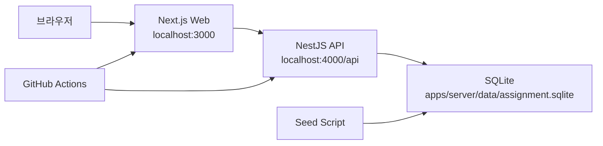
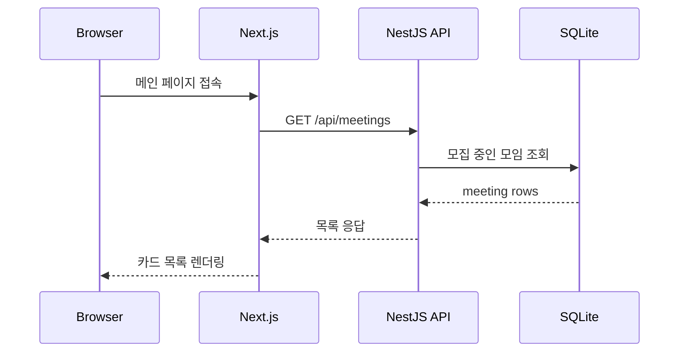
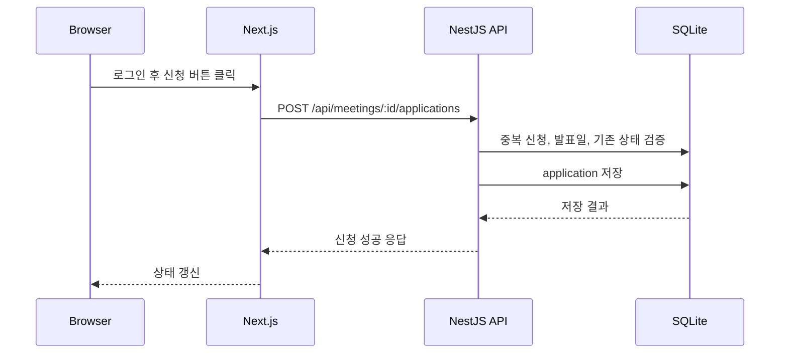
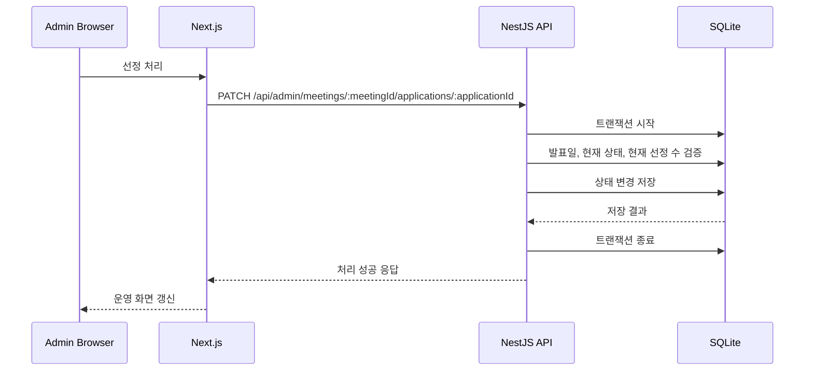
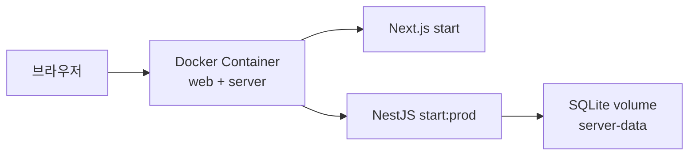
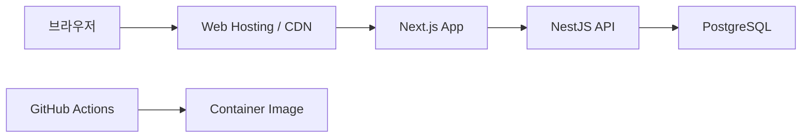

# 상상단 과제 인프라 아키텍처 정리

## 문서 목적

이 문서는 상상단 과제 프로젝트를 면접에서 설명할 때,
코드 구조가 아니라 **실행 구조와 배포 관점의 아키텍처**를 빠르게 설명하기 위한 문서다.

설명 기준은 아래 두 가지다.

1. 지금 제출한 프로젝트가 실제로 어떤 방식으로 실행되는가
2. 이 구조가 운영 환경으로 가면 어떤 식으로 바뀌는가

---

## 1. 한 줄 요약

현재 프로젝트는 **Next.js 프론트엔드 + NestJS API + SQLite**로 구성된 단일 풀스택 구조다.  
로컬에서는 `pnpm`으로 프론트와 서버를 함께 실행하고, Docker 실행 시에는 하나의 컨테이너 안에서 두 앱을 함께 띄운다.  
데이터는 SQLite 파일로 관리하고, CI에서는 seed → lint → build → e2e 순서로 검증한다.

---

## 2. 현재 실행 아키텍처

### 2-1. 로컬 실행 구조

### 설명

- 사용자는 브라우저로 Next.js 프론트엔드에 접속한다.
- 프론트엔드는 `NEXT_PUBLIC_API_URL` 기준으로 NestJS API를 호출한다.
- API는 SQLite 파일에 직접 접근해 데이터를 조회하거나 저장한다.
- `seed` 스크립트는 로컬 SQLite를 초기 상태로 다시 만들고 데모용 데이터를 넣는다.
- CI는 별도 런타임 서비스를 띄우는 대신, 같은 워크스페이스 안에서 lint/build/e2e를 순서대로 검증한다.

---

## 3. 구성 요소별 역할

### 3-1. 브라우저 / 프론트엔드

- Next.js App Router 기반
- 공개 모임 목록/상세, 로그인, 내 신청 결과, 운영 대시보드를 담당
- 인증 상태는 세션 쿠키 기반으로 판단
- 서버가 계산한 도메인 상태를 그대로 소비하고, 프론트가 규칙을 다시 계산하지 않도록 설계

### 3-2. 백엔드 API

- NestJS 기반
- 세션 로그인/로그아웃
- 공개 모임 조회
- 모임 신청 / 신청 취소 / 내 신청 결과 조회
- 관리자 모임 생성 / 신청자 조회 / 선정·탈락 처리
- 발표일 기준 결과 비공개, 중복 신청 방지, 정원 초과 방지 같은 핵심 규칙을 서버에서 책임짐

### 3-3. 데이터 저장소

- 과제 범위에서는 SQLite 사용
- 로컬 데모와 테스트 준비가 빠르고, 제출 환경도 단순하게 유지 가능
- 실제 서비스 확장 전까지는 단일 파일 DB로도 핵심 흐름 검증이 가능하다고 판단

### 3-4. CI

- GitHub Actions에서 아래 순서로 검증
  1. 의존성 설치
  2. seed
  3. web lint
  4. server lint
  5. web build
  6. server build
  7. server e2e

---

## 4. 요청 흐름

### 4-1. 공개 조회 흐름

### 4-2. 신청 흐름

### 4-3. 관리자 선정 흐름

---

## 5. 인증과 세션

### 현재 방식

- 서버는 `express-session` 기반 세션 인증 사용
- 로그인 후 세션 쿠키를 발급하고, 이후 요청에서 현재 사용자를 확인
- 관리자 기능은 로그인 여부와 관리자 권한을 모두 통과해야 접근 가능

### 왜 이 방식을 선택했는가

- 과제 범위에서 JWT, refresh token, Redis 세션 저장소까지 늘리는 건 과하다고 판단
- 로그인한 사용자와 관리자만 명확히 구분하면 현재 유즈케이스는 충분히 표현 가능
- 공개 조회와 인증이 필요한 행위를 분리하는 쪽이 구조가 더 단순했음

---

## 6. 환경별 구성 차이

### development / test

- CORS: `origin: true`
- 세션 시크릿: 개발용 기본값 허용
- 서버 env: `apps/server/.env.development`
- 테스트는 제출용 DB가 아니라 프로세스별 E2E SQLite 파일 사용

### production 가정

- CORS: `CORS_ORIGIN` 필수
- 세션 시크릿: `SESSION_SECRET` 필수
- secure cookie 활성화
- Docker 실행 시 `NODE_ENV=production` 기준으로 동작

---

## 7. Docker 기준 실행 구조

### 설명

- 하나의 컨테이너 안에서 프론트와 서버를 함께 실행한다.
- 컨테이너 시작 시 `server seed`를 먼저 수행한 뒤,
  `server start:prod`와 `web start`를 함께 띄운다.
- SQLite 데이터는 volume(`server-data`)에 저장해 컨테이너 재시작 후에도 유지할 수 있다.

### 왜 이렇게 구성했는가

- 과제 제출 기준에서는 컨테이너 수를 최소화하는 편이 설명과 실행이 단순함
- Docker Compose 한 번으로 바로 데모 가능한 경험을 우선
- 운영 분산 구조를 흉내 내기보다, 현재 프로젝트의 핵심 흐름을 빠르게 확인하는 데 집중

---

## 8. CI 구조

```mermaid
flowchart LR
    Push["Push / PR"]
    Checkout["Checkout"]
    Install["pnpm install --frozen-lockfile"]
    Seed["pnpm --filter server seed"]
    WebLint["web lint"]
    ServerLint["server lint"]
    WebBuild["web build"]
    ServerBuild["server build"]
    E2E["server e2e"]

    Push --> Checkout --> Install --> Seed --> WebLint --> ServerLint --> WebBuild --> ServerBuild --> E2E
```

### 의미

- 로컬에서 확인한 명령을 GitHub Actions에서도 같은 순서로 실행
- “내 컴퓨터에서만 된다”가 아니라 저장소 기준으로도 검증 가능한 상태를 유지
- E2E는 테스트 전용 DB를 사용하므로 제출용 데이터와 충돌하지 않음

---

## 9. 이 구조를 선택한 이유

### 9-1. 과제 범위에 맞게 단순화한 부분

- SQLite 사용
- 단일 API 서버
- 세션 기반 인증
- Docker에서도 단일 컨테이너 실행

### 9-2. 단순화했지만 놓치지 않은 부분

- 개발 / 테스트 / 운영 환경 분리
- CORS와 세션 시크릿의 운영 분기
- 제출용 DB와 E2E DB 분리
- GitHub Actions 기반 자동 검증

즉, 운영 인프라를 과하게 흉내 내기보다  
**현재 요구사항을 안정적으로 검증할 수 있는 최소 구조**를 먼저 만들었다고 설명할 수 있다.

---

## 10. 운영으로 확장한다면 어떻게 바뀌는가

### 가장 먼저 바뀔 부분

- SQLite → PostgreSQL
- 단일 파일 DB → 중앙 DB
- 필요하면 web / server 배포 단위 분리

### 그 이후 고려할 부분

- 관리자 처리 동시성 전략 고도화
- 운영 로그/모니터링
- 수정/삭제 같은 운영 기능 추가에 맞춘 관리자 화면 확장

이 프로젝트를 면접에서 설명할 때는  
“지금 구조는 과제 범위에 맞는 최소 실행 구조이고, 운영으로 가면 어떤 부분이 먼저 바뀌는지까지는 생각해봤다” 정도로 말하면 충분하다.
