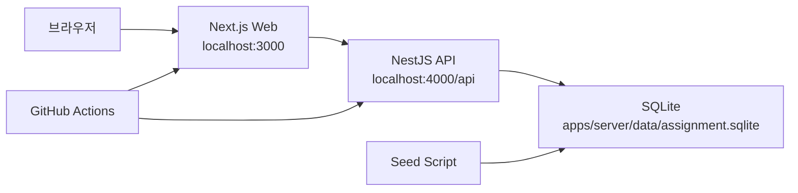
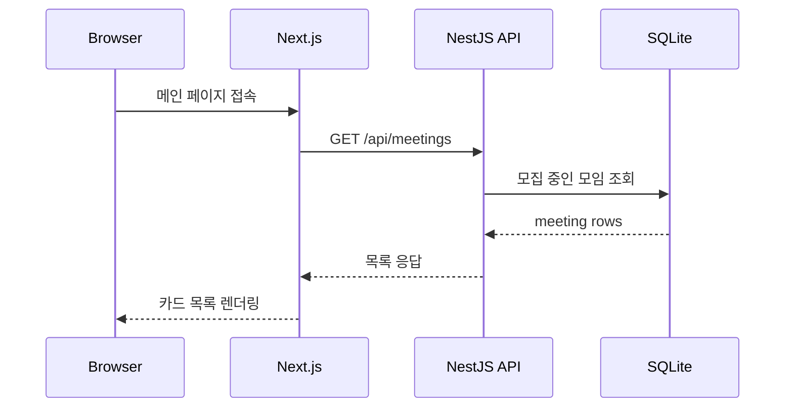
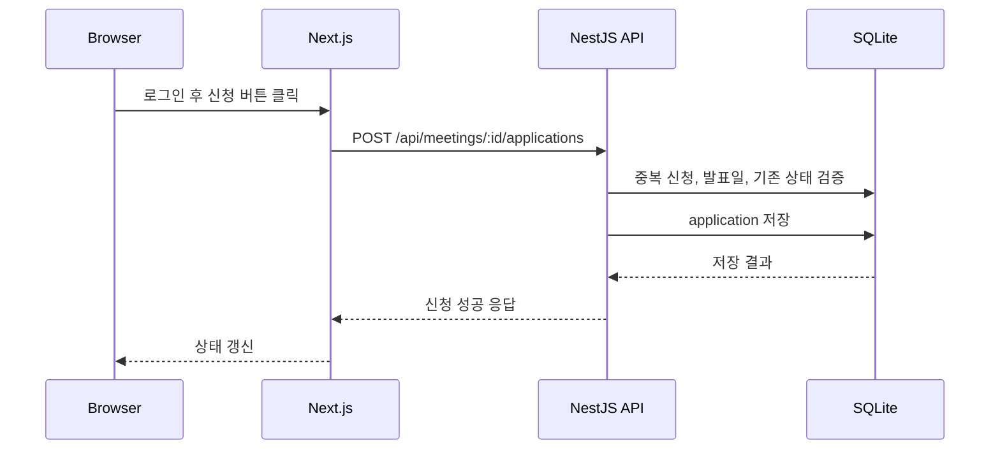
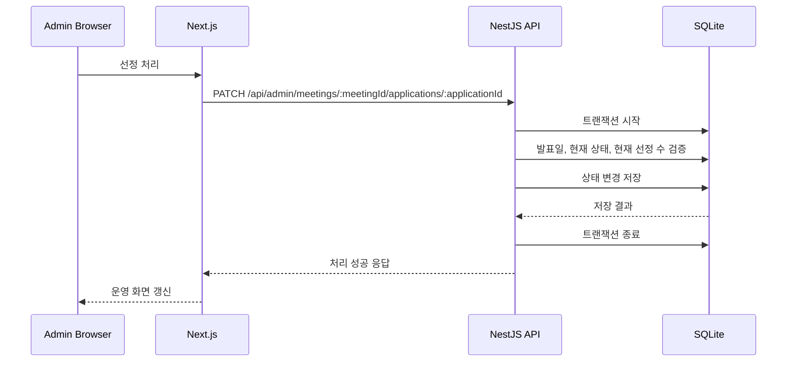
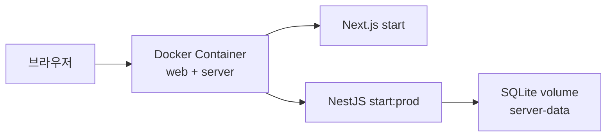
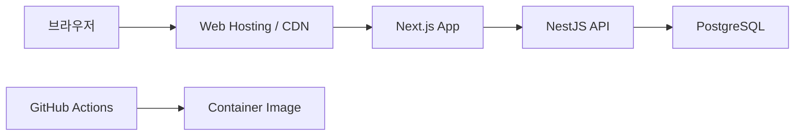

# 상상단 인프라 아키텍처 다이어그램

## 1. 현재 로컬 실행 구조

### 설명 포인트

- 사용자는 Next.js 프론트엔드에 접속
- 프론트는 NestJS API 호출
- API는 SQLite에 직접 접근
- seed가 초기 데이터 준비
- CI는 같은 저장소에서 lint/build/e2e 실행

---

## 2. 공개 조회 흐름

---

## 3. 신청 흐름

---

## 4. 관리자 선정 흐름

---

## 5. Docker 실행 구조

### 설명 포인트

- 하나의 컨테이너 안에서 프론트와 서버를 함께 실행
- 시작 시 seed 수행
- SQLite 데이터는 volume에 유지

---

## 6. CI 검증 구조

```mermaid
flowchart LR
    Push["Push / PR"]
    Checkout["Checkout"]
    Install["pnpm install --frozen-lockfile"]
    Seed["pnpm --filter server seed"]
    WebLint["web lint"]
    ServerLint["server lint"]
    WebBuild["web build"]
    ServerBuild["server build"]
    E2E["server e2e"]

    Push --> Checkout --> Install --> Seed --> WebLint --> ServerLint --> WebBuild --> ServerBuild --> E2E
```

---

## 7. 운영 확장 가정 구조

### 설명 포인트

- 가장 먼저 바뀌는 건 SQLite → PostgreSQL
- 필요하면 web / server 배포 단위 분리
- 지금은 과제 범위라 최소 구조를 유지
