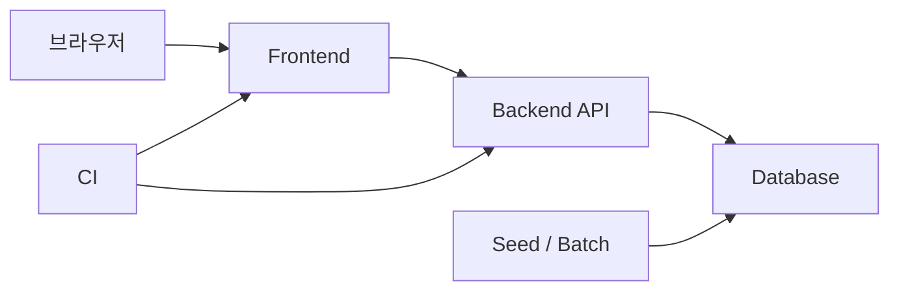
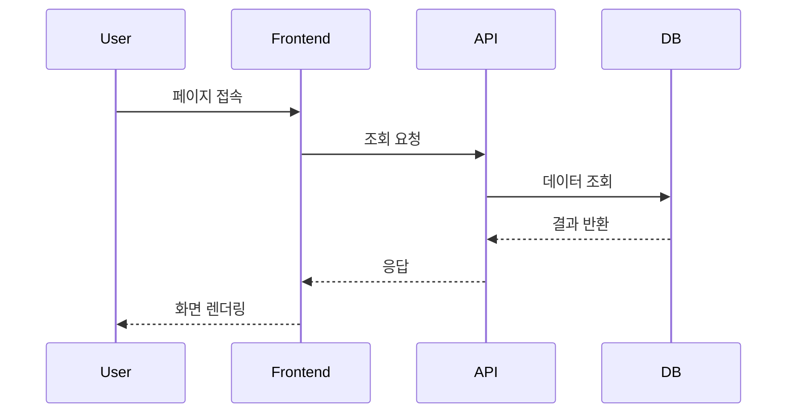
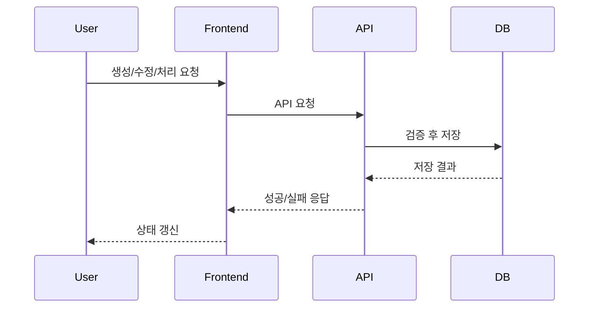
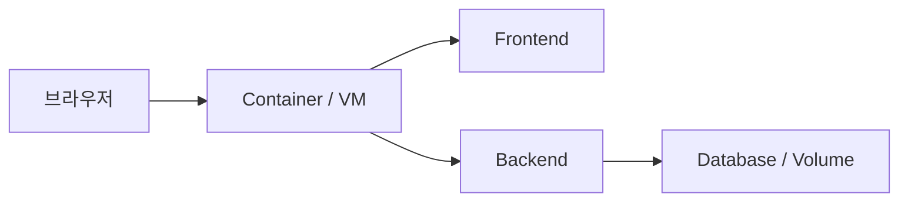
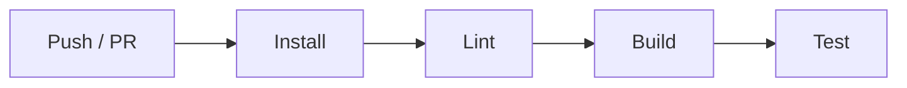
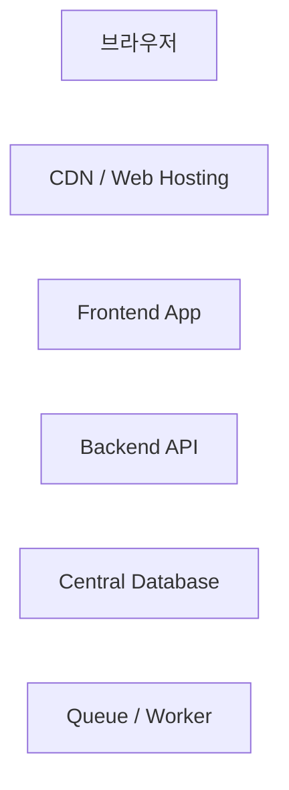

# 프로젝트 인프라 아키텍처 문서 템플릿

## 문서 목적

이 문서는 프로젝트의 **인프라 아키텍처**를 설명하기 위한 템플릿이다.  
코드 내부 설계보다 아래 질문에 답하는 데 초점을 둔다.

- 사용자는 어디로 접속하는가
- 프론트와 서버는 어떻게 연결되는가
- 데이터는 어디에 저장되는가
- 어떤 환경에서 어떻게 실행되는가
- 운영으로 확장하면 무엇이 먼저 바뀌는가

---

## 1. 한 줄 요약

이 프로젝트는 **[프론트엔드 기술] + [백엔드 기술] + [DB]** 로 구성된 [단일/분리] 구조다.  
[현재 범위/목적]에 맞춰 [왜 이런 구성을 선택했는지]를 한 문장으로 정리한다.

예시:

> 이 프로젝트는 Next.js 프론트엔드, NestJS API, SQLite로 구성된 단일 풀스택 구조이며, 과제 범위에서 핵심 흐름을 빠르게 검증할 수 있는 실행 구조를 우선했다.

---

## 2. 현재 실행 아키텍처

### 설명 포인트

- 사용자가 어떤 엔드포인트로 접근하는가
- 프론트가 어떤 방식으로 API를 호출하는가
- 백엔드는 어떤 저장소를 사용하는가
- seed, scheduler, batch가 있으면 어떤 역할을 하는가
- CI가 무엇을 검증하는가

---

## 3. 구성 요소별 역할

### 3-1. 프론트엔드

- 사용자 화면 / 관리자 화면
- SSR / CSR / SPA 중 어떤 특성이 중요한지
- 인증 상태와 API 호출 방식을 어떻게 다루는지

### 3-2. 백엔드

- 어떤 핵심 유즈케이스를 책임지는지
- 인증, 권한, 검증, 예외 처리를 어떻게 하는지

### 3-3. 데이터 저장소

- 현재 DB 선택 이유
- 정합성, 단순성, 운영성 관점에서 왜 이 DB를 썼는지

### 3-4. CI / 배포

- 어떤 검증을 자동화하는지
- 로컬 실행과 같은 기준인지

---

## 4. 주요 요청 흐름

### 4-1. 공개 조회 흐름

### 4-2. 쓰기 요청 흐름

필요하면 관리자 처리, 결제, 배치 처리 같은 별도 흐름도 추가한다.

---

## 5. 인증과 보안

### 현재 방식

- 세션 / JWT / OAuth 중 무엇인지
- 권한 분기가 어디서 일어나는지
- CORS, secure cookie, 환경 변수 관리 방식

### 왜 이 방식을 선택했는가

- 과제/서비스 범위 기준
- 복잡도와 운영성의 균형

---

## 6. 환경별 구성 차이

### development

- 로컬 실행 방식
- 환경 변수
- 데이터 준비 방식

### test

- 테스트 전용 DB/Mock/외부 의존성 처리

### production 가정

- 운영 환경에서 더 엄격해지는 설정
- 필수 환경 변수

---

## 7. Docker / 배포 구조

### 설명 포인트

- 단일 컨테이너인지, 서비스 분리인지
- volume 사용 여부
- 시작 시 seed/batch가 있는지

---

## 8. CI 구조

### 설명 포인트

- 로컬에서 확인한 명령과 같은지
- 어떤 검증을 신뢰 기준으로 삼는지

---

## 9. 이 구조를 선택한 이유

### 단순화한 부분

- 어떤 걸 일부러 안 넣었는지
- 왜 지금은 그 정도가 적절한지

### 단순화했지만 놓치지 않은 부분

- 테스트 격리
- 환경 분기
- 자동 검증
- 데이터 정합성

---

## 10. 운영으로 확장한다면

### 가장 먼저 바뀔 부분

- DB 교체
- 서비스 분리
- 모니터링 / 로깅

### 나중에 볼 부분

- 캐시
- 비동기 처리
- 멀티 인스턴스 동시성 제어

이 섹션은 “지금 당장 다 하겠다”가 아니라,  
**운영으로 가면 무엇이 먼저 바뀌는지 알고 있다**는 정도로 설명하면 충분하다.
